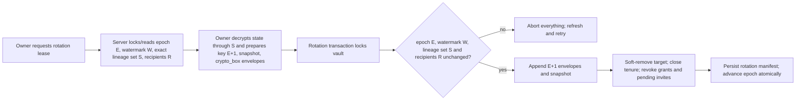

# P07 Implementation Evidence — Revision 02

## Immutable no-code boundary

- Package/revision/scope: `P07` / `02` / HS-011 architecture evidence correction.
- Original package BASE: `fe1871ce7dce1e831b57ee5656d38ce5c800aae3`.
- Required unchanged pre-implementation HEAD: `033cb8f6d37208c1ba6ac0b0907672aa18e4ad6d`.
- Allowed implementation paths: none. No product, test, migration, configuration, dependency,
  ledger, prior artifact/review, scratch, frozen source, SCOPE or agent path may change.
- Sole worker write: `specs/007-human-scratch-completion/evidence/P07/implementation-02.md`, created
  before further evidence work, intentionally uncommitted.
- At dispatch, the index and untracked set were empty. Git-visible dirt was exactly root-owned
  unstaged `HANDOFF.md` and `PROGRESS.md`.

## Correction plan

1. Preserve the independently accepted linked-hybrid architecture and every unaffected revision-01
   P08 clause.
2. Replace F-001's lossy discard/reinitialize model with an explicit, crash-recoverable,
   continuously-authorized per-epoch transition and exact-operation preservation protocol.
3. Replace F-002's impossible SQL/CRDT transaction claim with a minimum capability-bound snapshot
   read, atomic SQL acceptance truth and deterministic client-side CRDT reconciliation saga.
4. Make onboarding, schema/backfill/reversal, threat/privacy and test requirements executable and
   map every revised clause to proof.
5. Recheck formatting, frozen sources, workspace/HEAD/index boundaries and cleanup; do not claim
   review PASS or P08 dispatch readiness.

## Revision outcome

This revision implements canonical Q-014 as an evidence correction and closes both review findings
without changing the selected architecture:

- **F-001 is corrected:** an active member never discards an old epoch key until every locally
  durable, unpushed operation from that authorization tenure is classified against the rotation's
  permanent-operation set, re-encrypted under the current key, durably persisted, published with the
  same semantic lineage, and acknowledged as either already covered or newly inserted. A local
  journal contains ciphertext references and state only; keys and plaintext operations remain
  memory-only and are zeroized.
- **F-002 is corrected:** the server performs no CRDT Person mutation. A bearer-bound read lets the
  client authenticate the real vault key and current snapshot before mutation; one SQL transaction
  establishes durable membership/acceptance truth; then a reconstructible client saga creates or
  links one deterministic encrypted Person, persists selection and syncs before showing success.
- **Onboarding is decided:** invite-aware first-user registration defers default-vault creation.
  Successful acceptance selects the shared vault; explicit cancellation or terminal invalidity
  resumes ordinary default-vault creation exactly once.

Revision 01's current-state trace and installed-CLI observations remain accurate and immutable. The
independent review accepted the linked-hybrid direction, terminology, member-only governance,
sender-bound fragment capability, stable membership identity, display privacy and clauses not named
below. This artifact restates the full corrected contract so P08 does not need to combine an unsafe
clause from revision 01 with this correction.

This artifact does not claim review PASS. P08 remains unavailable until revision 02 independently
passes and the D-011/P05 genuinely-hidden-topology gate is rechecked successfully.

## Retained architecture decision

### Status and selection

`Proposed for independent P07 revision-02 review.` The selected architecture remains **linked
hybrid**:

- `Vault Settings > Access & Members` is the sole authoritative membership/invite surface.
- People remains the financial allocation/settlement surface. It may display an optional membership
  link/status and an authorized `Manage access` deep link, but Person edit/delete never grants or
  revokes access.
- **Person** means an encrypted financial record, **Member** means a server-authorized identity with
  a vault-key envelope, and **Invite** means a single-use bearer capability.
- Only member invitations and member removal ship in P08. Owner promotion, transfer, demotion and
  removal remain out of scope; existing additional owners are visible but immutable. Standalone
  `vault.leave` is deprecated/rejected or becomes an owner-actionable request until it can invoke
  the same rotation protocol.
- Person linkage uses stable vault-scoped membership UUID, not a displayed global pubkey hash.
  Optional profile labels live only in encrypted CRDT data and never authorize access.

The dedicated-settings-only option still misses HS-012's financial association, while People-owned
access still conflates financial history with cryptographic authority. The linked hybrid remains the
narrowest reversible, least-privilege answer to the frozen wording.

### Corrected consequence

The SQL-owned portion of removal—new snapshot metadata/ciphertext, per-recipient envelopes,
membership status, epoch, grants and invites—can be atomic. Locally unpushed encrypted operations
cannot be part of that server transaction; continuously active clients reconcile them through the
lossless transition below. Likewise, SQL acceptance and encrypted CRDT Person/link state are two
durable boundaries joined by a resumable saga, not one transaction.

A removed member may retain plaintext/key material it downloaded while authorized. P08 must say
removal prevents future access, not that past copies are erased. It must not grant that member—or a
later reactivation tenure—any historical envelope it could not access while continuously active.

## Protocol ownership and storage model

| Record/state                        | Durable owner      | Required fields and authority                                                                                                                                                      | Plaintext boundary                                   |
| ----------------------------------- | ------------------ | ---------------------------------------------------------------------------------------------------------------------------------------------------------------------------------- | ---------------------------------------------------- |
| Vault epoch head                    | server SQL         | `vault_id`, monotonic `current_epoch`, monotonic operation watermark and permanent-lineage-set digest; mutations lock the vault row                                                | Identifiers/counters only                            |
| Membership tenure                   | server SQL         | stable `membership_id`, derived identity hash, role, recipient X25519 public key, monotonic `access_generation`, `active_from_epoch`, nullable `removed_at`/`active_through_epoch` | No name/profile                                      |
| Per-epoch key envelope              | server SQL         | `(membership_id, access_generation, epoch)`, authenticated-box version, authoritative sender and recipient X25519 public keys, ciphertext                                          | Vault key remains encrypted                          |
| Epoch snapshot                      | server SQL         | epoch, ciphertext, version vector, snapshot watermark, exact permanent lineage-set digest, rotation id                                                                             | CRDT snapshot remains encrypted                      |
| Permanent operation                 | server SQL         | transport UUID, stable `lineage_id`, epoch, server sequence, version vector, encrypted bytes, derived author                                                                       | CRDT update remains encrypted                        |
| Rotation manifest                   | server SQL         | rotation id, from/to epochs, exact covered permanent lineage set/digest, watermark, recipient set and resulting snapshot id                                                        | No CRDT plaintext                                    |
| Invite                              | server SQL         | route UUID, epoch, invite X25519 public key, domain-separated capability-signing public key, sender metadata/envelope, encrypted Person intent, expiry/status                      | Secret and Person intent remain unavailable          |
| Acceptance truth                    | server SQL         | unique invite/attempt, caller-derived membership UUID, access generation, vault/epoch/snapshot binding, encrypted intent, reconciliation claim/status                              | No Person/name plaintext                             |
| Local operation/cache               | IndexedDB          | operation epoch/lineage, ciphertext, version vector, pushed flag; snapshot epoch/watermark                                                                                         | No operation/snapshot plaintext at rest              |
| Epoch transition journal            | IndexedDB          | transition id/state, membership/access generation, source/target epochs, snapshot/manifest binding, old lineage ids, replacement transport ids, covered/publish/ack states         | No key, decrypted update, Person/name or fragment    |
| Acceptance saga journal             | IndexedDB          | acceptance/membership/vault ids, stage, deterministic Person/link ids, reconciliation op id/ack and selection status                                                               | No fragment, key, plaintext Person intent/name       |
| Active vault keys/decrypted updates | client memory only | branded key material unwrapped from authorized envelopes; exact Loro bytes only while importing/re-encrypting                                                                      | Zeroized/dropped at transition/acceptance boundaries |

`crypto_box` authenticated sender/recipient envelopes are the sole P08 vault-key-envelope
convention. P08 removes the sealed-box alternative from revision-01 clause 17. Capability proof is
an Ed25519 signature derived domain-separately from the fragment secret; it is proof, not a key
envelope. All primitives use libsodium, exact length/version validation and client-side key
handling.

### Continuous-authorization rule

Historical-envelope reads require all of these:

1. the signed caller maps to the exact membership row;
2. that row is active (`removed_at IS NULL`);
3. the requested envelope belongs to the row's **current** `access_generation`; and
4. the requested epoch lies within that uninterrupted generation's active interval.

Removal closes the interval and denies all subsequent envelope fetches, including old epochs. Safe
reacceptance preserves `membership_id` for Person history but increments `access_generation` and
creates only a current-epoch envelope. Thus a re-added identity does not reacquire keys from its
prior tenure. A member invited at epoch N has no envelope for epochs before N; it can read financial
history only through the authorized current snapshot.

Historical envelope rows are retained for an active generation because an offline device may hold an
arbitrarily old `pushed=false` operation. No garbage collection is allowed until a later reviewed
protocol can prove every device has no such ciphertext. Server export/reversal retains these rows;
their endpoint remains protected and least-field.

## F-001 correction — lossless epoch transition

### Server rotation preparation and commit

The operation lineage closes the acknowledgement-race hole. A normal operation starts with
`lineage_id = transport_id`. Re-encryption changes ciphertext/epoch/transport id but retains the
same lineage. The server enforces one permanent row per `(vault_id, lineage_id)`, so an old
operation which reached the server before its acknowledgement and a later replacement cannot both
become distinct semantic operations.



The preparation response contains a short-lived rotation id, current epoch, server-assigned
operation watermark, exact permanent lineage set or a canonical digest plus membership-proof
endpoint, current snapshot binding, exact active recipients/public keys and pending invite set. The
owner materializes a complete Loro document from the authenticated snapshot plus every permanent
operation through that set, creates a fresh 32-byte key, encrypts the epoch+1 snapshot and wraps it
for every remaining active recipient with authenticated `crypto_box` using the owner's authoritative
sender key.

The commit transaction serializes with `append_vault_ops` on the vault row. It verifies the exact
epoch, watermark, permanent lineage set/digest, active recipient/access-generation set, target
member and pending-invite set. On success it appends—not overwrites—epoch+1 envelopes, records the
snapshot/manifest, soft-removes only the member target, closes that access generation, revokes its
Realtime grants, revokes every pending invite and advances the epoch. Any operation appended before
the transaction changes the watermark/set and aborts rotation; after the advance, an old-epoch
append is rejected. There is no timing window in which an accepted permanent old operation is absent
from both the snapshot and manifest.

### Remaining-client transition state machine

The sync manager sends epoch on every snapshot/op request and publish. `EPOCH_ADVANCED` is a typed
response, never a generic retry. Once observed, every tab stops old-epoch publication and local
mutation, displays a non-success `Updating vault security` state, and enters a per-vault cross-tab
transition lock. Non-leader tabs observe IndexedDB/BroadcastChannel state and cannot publish.

```mermaid
stateDiagram-v2
    [*] --> observed: current server epoch is newer
    observed --> planned: journal + complete old unpushed lineage set durably captured
    planned --> authenticated: active-generation old/current envelopes and current snapshot authenticate
    authenticated --> materialized: each uncovered old update is exactly re-encrypted and durably mapped
    materialized --> publishing: only current-epoch replacements are sent
    publishing --> adopted: every lineage acknowledged; current snapshot plus replacements saved
    adopted --> complete: local epoch switches; old ciphertext cleaned; old key zeroized
    observed --> denied: membership no longer active
    denied --> [*]: retain old local data; no publish/new envelope
```



State requirements:

1. **Observed.** Freeze auto-sync and document writes for the vault. Persist source epoch(s), target
   epoch, membership/access generation and transition id before key conversion. If offline, keep all
   ciphertext and wait; do not guess the new key or delete state.
2. **Planned.** In one IndexedDB transaction enumerate every `pushed=false` operation with epoch
   below target, record its stable lineage and a generated-once replacement transport id, and bind
   the journal to the authenticated target snapshot/rotation manifest. Reopening/retrying produces
   the same mapping.
3. **Authenticated.** Through the signed, least-field envelope endpoint, fetch only this active
   generation's required source envelope(s) and current envelope. Unwrap keys in memory, verify
   sender/recipient/version/epoch, authenticate the target snapshot and ask the immutable manifest
   membership endpoint which local lineages were already permanent at rotation.
4. **Materialized.** For **every** old `pushed=false` operation, decrypt the ciphertext with its
   source-epoch key, import the exact same Loro update bytes into the authenticated target snapshot,
   encrypt those same bytes with the target key and preserve its version vector/lineage. Persist the
   generated-once replacement transport id, target-epoch ciphertext and journal state atomically,
   even when the manifest says that lineage already became permanent during an acknowledgement race.
   Plaintext/key bytes never enter the journal.
5. **Publishing.** Send every persisted target/current-epoch replacement. Server active-generation/
   current-epoch checks and unique lineage return one of two durable acknowledgements: `covered`
   when the lineage was already in the rotation snapshot, or `inserted` when the current-epoch
   replacement becomes its sole permanent row. A crash after insert but before local acknowledgement
   retries the same transport/lineage and receives the same idempotent result. The original old row
   is not deleted or marked superseded until the replacement is durable and its lineage is
   acknowledged.
6. **Adopted.** Pull any current-epoch operations after the rotation watermark, import them and the
   replacements, persist an authenticated current local snapshot and atomically set local current
   epoch. Only now may new edits resume; they are encrypted as current-epoch normal operations.
7. **Complete.** Persist a compact non-secret completion receipt, then remove superseded old local
   ciphertext and zeroize all source-epoch keys. Envelope history remains server-side for other
   devices in the same active generation. If the vault advances again mid-transition, preserve the
   journal and repeat toward the newest epoch; never delete an intermediate source until its lineage
   is permanent under the newest target.

The removed target follows the `denied` branch: it receives no new envelope/snapshot/Realtime grant,
cannot fetch old envelopes after tenure closure, and cannot publish old operations. Its pre-removal
local ciphertext/key may remain readable as the honest past-copy limitation, but the server grants
no historical or future capability it did not already possess.

### Crash/idempotency proof obligations

| Injected boundary                                  | Durable recovery invariant                                                               |
| -------------------------------------------------- | ---------------------------------------------------------------------------------------- |
| before journal creation                            | untouched old ciphertext remains; detection restarts                                     |
| after journal, before envelope fetch               | source ids/mappings remain; active caller refetches least-field envelopes                |
| after key unwrap/snapshot decrypt                  | no plaintext/key is durable; reload unwraps again from authorized history                |
| between classification records                     | one IndexedDB transaction per mapping resumes the first incomplete lineage               |
| after replacement encryption, before local put     | old ciphertext remains authoritative; replacement is regenerated with the stored id      |
| after local put, before publish                    | current ciphertext/mapping is durable and sent once by stable lineage                    |
| after server insert, before local ack              | retry returns the existing lineage; no duplicate semantic op                             |
| after all acks, before snapshot/local-epoch switch | mappings and acknowledgements rebuild the same current document                          |
| after local switch, before cleanup/zeroization     | completion is monotonic; cleanup repeats without deleting current data                   |
| concurrent old server append                       | shared vault-row serialization changes set/watermark; rotation aborts and owner rebuilds |
| second rotation during transition                  | prior journal/ciphertexts remain; active envelope history allows a new target transition |

No transition state may contain plaintext operations, vault keys, fragments, recovery material or
Person names. Storage-unavailable mode may not silently fall back to memory for a security
transition: it remains blocked with old ciphertext preserved until durable journal storage is
available.

## F-002 correction — capability read and acceptance saga

### Fragment-derived keys and pre-membership read

Invite creation derives two independent keypairs from the same exact 32-byte fragment secret with
distinct fixed domains:

- an X25519 invite recipient pair for the owner's authenticated `crypto_box` vault-key envelope;
- an Ed25519 capability-signing pair used only to prove secret possession during acceptance.

Only public keys are stored. The raw fragment secret and both derived secret keys stay client-side.
The protected identity still signs the complete P04 mutation; the capability signature is an
additional one-time proof and cannot select actor, vault or role.

The minimum pre-membership endpoint accepts only route invite UUID plus the derived invite X25519
public key. For an exact unexpired/unrevoked/unconsumed/current-epoch pair it returns:

- envelope version, epoch, authoritative sender X25519 public key, invite recipient public key and
  encrypted real vault-key envelope;
- opaque current snapshot id, encrypted snapshot, version vector, server watermark and digest of the
  permanent lineage set;
- a short-lived one-use acceptance challenge required for secret-possession proof.

It returns no vault id/name, roster, identity hash, creator label, role choice or plaintext Person
intent; the opaque encrypted intent remains on the locked invite and is copied only into acceptance
truth after SQL success. Responses are `no-store`, rate-limited and redacted from
procedure/request/error logging. Absent, malformed-key, UUID-only enumeration, expired, revoked,
consumed, stale-epoch and substitutions across vaults produce the same generic external result and
comparable response shape/timing. Possession of the exact pair reveals ciphertext size, expiry and
activity watermark to the intended bearer; the UI warns that the link is a bearer capability. It
reveals no plaintext.

The client opens the authenticated owner-to-invite envelope, requires exactly 32 key bytes, and
authenticates the returned snapshot before SQL mutation. It signs a canonical tuple containing
invite UUID, both stored capability public keys, challenge, epoch, snapshot id/watermark/digest,
caller identity hash, caller recipient X25519 public key, self-envelope digest and
acceptance-attempt UUID with the derived capability Ed25519 secret. The server verifies this
signature against the invite row. A leaked database public key or derived lookup value cannot
consume an invite without the fragment-derived signing secret.

The fragment remains in a fragment-only URL, masked, until durable SQL acceptance truth exists; this
is the only crash-safe way to retry a pre-SQL failure without persisting the bearer secret. It is
never sent raw. Immediately after the transaction is confirmed—or a protected pending-acceptance
read proves it committed—the client clears the fragment with `history.replaceState` and zeroizes the
fragment/invite secret keys. Before that boundary, reload restarts preflight from the fragment;
after it, reload resumes from membership/acceptance truth and the self-wrapped current key.

### Atomic SQL acceptance truth

```mermaid
sequenceDiagram
    participant C as Invitee client
    participant P as Capability read
    participant S as SQL accept transaction
    participant L as Local encrypted CRDT saga
    C->>P: invite UUID + derived X25519 public
    P-->>C: sender/envelope + encrypted snapshot/watermark + challenge
    C->>C: unwrap real key; authenticate snapshot; self-wrap; capability-sign tuple
    C->>S: identity-signed accept + capability proof + prepared binding
    S->>S: lock invite, vault, snapshot, membership; verify exact epoch/binding/proof
    S->>S: consume invite; create/reactivate membership; append self-envelope; write acceptance truth
    S-->>C: stable membership/access generation + vault/current binding + reconciliation required
    C->>L: resume deterministic Person/link/selection/sync
```

The transaction is the only acceptance authority. It:

1. locks the exact UUID/invite-public-key/challenge row, vault epoch/current snapshot and caller's
   membership row;
2. verifies expiry/status, current epoch and prepared snapshot watermark/digest, the P04-derived
   caller, exact encodings and capability signature;
3. creates a new stable membership or reactivates the same membership UUID with incremented access
   generation, member role and caller self-wrapped current key; it never promotes an owner;
4. consumes the invite/challenge and writes an immutable acceptance row keyed by invite and
   acceptance-attempt UUID, retaining only the opaque encrypted Person intent; and
5. returns membership UUID, access generation, vault id, epoch/snapshot binding and
   `reconciliation_required`.

If snapshot/epoch changed after preflight, the whole transaction returns typed stale-preflight and
leaves the invite unconsumed; the client refetches and reauthenticates. Same-caller/same-attempt
retry after a lost response returns the existing truth. Another caller, attempt substitution, replay
or consumed-link lookup receives the generic invalid result. A protected, caller-derived
`pendingAcceptances` read reconstructs committed-but-unfinished work even when the originating local
journal was never written.

The transaction does **not** create, link, select or claim to roll back a CRDT Person.

### Deterministic client reconciliation saga

```mermaid
stateDiagram-v2
    [*] --> sqlAccepted: acceptance truth exists
    sqlAccepted --> vaultAuthenticated: own envelope + current snapshot authenticate
    vaultAuthenticated --> linkDurable: one encrypted CRDT transaction is durably journaled
    linkDurable --> linkSynced: semantic link op is server-acknowledged or already present
    linkSynced --> selectionDurable: shared vault selection persists
    selectionDurable --> reconciled: protected acknowledgement; local proof complete
    reconciled --> [*]
```



Every authenticated app load checks protected acceptance truth before normal vault success UI. The
local journal is an optimization; server truth plus membership self-envelope and encrypted intent
can reconstruct it. The saga remains visibly `Finishing setup` until all stages complete.

1. **SQL accepted.** Persist/recover the acceptance id, membership id/access generation and vault
   binding. Clear/zeroize the fragment boundary as above. Offline operation now means retry later,
   not cancellation or default-vault creation.
2. **Vault authenticated.** Unwrap the membership's current self-envelope, authenticate the current
   snapshot and process any intervening epoch through the F-001 transition. Decrypt the opaque link
   intent client-side.
3. **Link durable.** Use encrypted CRDT maps keyed by `membershipId`. A link intent naming a valid
   unlinked Person selects that id; otherwise derive the new Person id deterministically from
   `(vaultId, membershipId)` using a fixed UUID namespace. One Loro transaction upserts the Person
   with `linkedMembershipId`, `membershipLinks[membershipId] = personId` and the reciprocal
   `personMembershipLinks[personId] = membershipId`; it never creates a second random Person.
   Conflicting reciprocal state becomes repair-required rather than an automatic overwrite. Persist
   the encrypted update as `pushed=false` and advance the saga journal in one IndexedDB transaction
   before treating the mutation as durable.
4. **Link synced.** Push the stable reconciliation lineage under the current epoch. Retry/concurrent
   tabs may emit redundant same-value CRDT assignments, but deterministic map/person keys converge
   to exactly one active Person and one membership link. Server lineage/idempotency prevents one
   local saga from being published twice. Existing satisfying CRDT state is observed, not recreated.
5. **Selection durable.** Persist the accepted shared vault as the originating device's active vault
   only after its local document contains the canonical link. Reload validates both selection and
   link before advancing.
6. **Reconciled.** After the link operation is server-acknowledged (or pulled as permanent) and
   selection is durable, send a signed reconciliation acknowledgement referencing the permanent op
   lineage. The server can verify actor/operation existence but not encrypted content. The client
   independently verifies one link/Person before showing success. All later loads still perform the
   idempotent invariant check; a global acknowledgement never suppresses device-local validation.

Crashes before the combined CRDT Person/link transaction leave no Person. Crashes after local
durability retry the same deterministic ids/lineage. Crashes after server sync but before local ack
observe the permanent lineage. Crashes before/after selection reapply the same vault id. Concurrent
tabs coordinate through a per-acceptance lock when available and converge through deterministic CRDT
keys when not. Ambiguous legacy links enter an explicit repair state; they are preserved and never
auto-merged/deleted.

| Injected acceptance boundary                                         | Durable recovery invariant                                                                     |
| -------------------------------------------------------------------- | ---------------------------------------------------------------------------------------------- |
| before SQL transaction                                               | invite remains usable unless protected truth proves the transaction committed                  |
| after SQL commit, before response/local journal                      | `pendingAcceptances` reconstructs the same membership/acceptance; no second consume            |
| after current-key/snapshot authentication                            | no plaintext/key is durable; membership self-envelope permits retry                            |
| during Person field write, before link field/CRDT commit             | no encrypted update or saga advance is durable; deterministic transaction restarts             |
| after combined Person/link CRDT commit, before IndexedDB transaction | in-memory partial state is disposable; reload deterministically emits both fields again        |
| after encrypted Person/link op and journal commit, before push       | one durable `pushed=false` reconciliation lineage resumes                                      |
| after server operation insert, before local acknowledgement          | same lineage is observed/acknowledged; no second Person/link                                   |
| after link sync, before vault selection                              | selection persists on resume only after link invariant recheck                                 |
| after selection, before reconciliation acknowledgement               | same vault id remains selected; signed acknowledgement retries                                 |
| after acknowledgement, before success render                         | every load rechecks authenticated vault, canonical link, permanent lineage and local selection |
| concurrent tabs at any stage                                         | per-acceptance lock serializes locally; deterministic CRDT keys converge if leaders race       |

### Deterministic invite-aware onboarding

- New-user navigation carries only the route/secret in the URL fragment. Registration creates the
  P06 identity-only row but **does not call default-vault creation** while an invite is pending.
- After unlock/registration, preflight and acceptance run. Successful reconciliation selects the
  shared vault and enters it; no personal vault is orphaned.
- Explicit pre-SQL cancellation or a confirmed terminal invalid/expired/revoked result clears and
  zeroizes the fragment, exits invite mode, invokes ordinary idempotent default-vault creation once
  and selects it. A transient offline/server/finishing error does not create a default vault.
- After SQL acceptance there is no invitation cancellation: membership is durable and the UI offers
  retry/resume `Finishing setup`. Any later leave/removal follows the reviewed member-removal flow.
- Existing-user unlock preserves the fragment client-side, returns to preflight and never converts
  it into a query parameter, server component value, log or referrer.

## Revised complete P08 acceptance contract

All 29 clauses remain mandatory. Clauses 10, 13, 14, 17–19, 22 and 28 are corrected/expanded for
Q-014; the other clauses retain revision-01 outcomes.

### A. Authoritative surfaces and permissions

1. Vault Settings contains discoverable `Access & Members` on desktop/mobile. People copy describes
   financial participants and does not promise hidden invitation behavior.
2. Owners see safe active-member/pending-invite state and member-only create/copy/revoke/remove
   controls. Members see a privacy-safe roster and own role without mutations. Outsiders receive no
   roster. Direct member/outsider mutation is server-rejected.
3. Every protected mutation retains P04 signing and server-derived caller identity. Vault, role,
   target membership and invite authority come from locked rows, never client claims.
4. P08 invite/removal targets members only. Owner governance is excluded. Standalone insecure leave
   is rejected/deprecated or owner-coordinated through the same atomic rotation.
5. Endpoints return least fields and normalize absent/expired/revoked/tampered/unauthorized states
   so roster, invite, vault and identity enumeration do not result.

### B. Versioned real-key invitation

6. The fragment secret is exactly 32 libsodium-random bytes, unpadded base64url and never appears
   raw in request/path/query/server props/log/analytics/referrer/console/error/test artifact.
7. Creation stores exact-length/versioned authenticated `crypto_box` metadata using the sender key
   selected from the owner's membership plus the domain-separated capability-signing public key. The
   server does not trust caller-claimed sender identity.
8. Preflight/acceptance bind route UUID, derived invite X25519 public key, capability proof, current
   epoch and prepared snapshot. Tamper, cross-vault, replay and concurrent double acceptance fail
   closed without an oracle.
9. Invites wrap one explicit epoch. Epoch advance atomically revokes pending invites; owners issue
   fresh links instead of carrying bearer capabilities over a security-boundary change.
10. The minimum pre-membership endpoint and proof above return only sender/envelope plus encrypted
    current snapshot/watermark/digest/challenge. The client proves secret possession, obtains
    exactly 32 real key bytes and authenticates that snapshot **before** the SQL transaction.
11. The invitee self-wraps that exact key with authenticated `crypto_box`; acceptance stores the
    membership identity derived from the caller, recipient/sender public key, envelope version,
    epoch and tenure. `VaultProvider` opens using explicit sender metadata.
12. Placeholder/random membership ciphertext is forbidden. Pre-SQL crypto/authentication failure
    leaves invite, membership, Person and selection unchanged.
13. Raw fragment material remains only in the fragment and client memory until durable SQL truth,
    then is immediately removed/zeroized. Reload before commit retries from the fragment; reload
    after commit resumes from protected truth/self-envelope. No plaintext local capability store.
14. Invite-aware first-user registration deterministically defers default-vault creation. Success
    selects the shared vault; explicit cancellation/terminal pre-SQL failure resumes idempotent
    ordinary default creation; transient/post-SQL finishing states do not.
15. Generated links are masked and exposed only through explicit Copy with visible confirmation.
    Expiry/revoke remain visible without leaving the fragment rendered after use.

### C. Atomic rotation and lossless epochs

16. Vaults, membership/envelope history, snapshots and operations carry monotonic epoch metadata;
    operations additionally carry server watermark and stable lineage. Legacy data backfills
    epoch 0.
17. Owner preparation uses a fresh 32-byte key, exact permanent lineage set/watermark, complete
    authenticated snapshot and authenticated `crypto_box` envelopes for every exact remaining active
    recipient. Sealed boxes are not a P08 envelope option.
18. One owner-only SQL transaction validates locked epoch/watermark/lineages/recipients/target/
    invites, appends new snapshot and envelope history, soft-removes target, closes its tenure,
    revokes grants/invites and advances epoch. Concurrent operations abort/retry the entire
    rotation.
19. Every continuously active client follows the durable transition state machine above: classify
    all `pushed=false` old lineages, decrypt/import every exact update with authorized source keys,
    persist/re-encrypt/publish every replacement under current epoch, receive an acknowledgement of
    either covered or inserted, adopt current snapshot, then zeroize. No old publish, plaintext
    journal, silent discard or memory-only fallback.
20. Removed clients receive no current/historical envelope after tenure closure, no future payload
    and no old-epoch publish; they cannot decrypt future data. UI/tests honestly preserve the
    limitation for past copies. Remaining clients preserve offline work exactly once.
21. Membership removal is soft. Every permission/list/realtime/envelope query requires active
    tenure. Reacceptance preserves membership UUID but increments access generation and grants only
    current epoch, preserving Person history without restoring prior keys.

### D. Crash-recoverable Person linkage and display privacy

22. Acceptance is the explicit two-boundary protocol above: atomic/idempotent SQL truth returns a
    stable membership UUID, then every load resumes the deterministic encrypted CRDT Person/link,
    current-vault selection and sync saga. It converges to exactly one link/Person and never claims
    SQL rolled back or mutated encrypted CRDT state.
23. Optional Person intent/display data remains opaque server ciphertext and is decrypted only by an
    authorized client. Optional names remain valid; no plaintext identity/profile field is added.
24. Display fallback remains explicit Person name, encrypted member-profile name, `You` for self,
    then `Member` plus vault-scoped disambiguator. Raw/truncated pubkey hashes and encryption keys
    are never rendered or exposed as accessible names.
25. Removal preserves linked Person, allocations, settlement and history and changes only access
    status. Re-add uses the same membership/link. Person delete/unlink never revokes membership;
    duplicate/ambiguous legacy data is preserved for repair.
26. Encrypted member profiles keyed by membership UUID are convenience data only and never affect
    SQL roles, signatures or access. P06's removed plaintext/global user blob is not reintroduced.

### E. Accessible and honest interaction

27. Create/copy/revoke/remove/accept/cancel/retry are keyboard-operable with visible focus,
    meaningful names and live status/errors. Removal identifies member/future-access consequence,
    confirms destructiveness and restores focus predictably.
28. Invalid/expired/revoked/consumed/corrupt/offline/stale-preflight/transition/acceptance states
    are stable, non-enumerating and recoverable. UI remains `Finishing setup` after SQL acceptance
    and cannot claim success before authenticated vault, one Person/link, sync and selection all
    prove.
29. Desktop/mobile, light/dark, reduced-motion and 200% zoom/reflow expose all authorized actions
    without clipping, horizontal traps or off-viewport controls, including the current reproduced
    mobile menu/Person-label regression.

## Complete clause-to-proof map for P08

| Clause | Required automated proof                                                                                                | Required real/manual proof                                                                      |
| ------ | ----------------------------------------------------------------------------------------------------------------------- | ----------------------------------------------------------------------------------------------- |
| 1      | route/component role tests and People-copy assertion                                                                    | owner finds Access & Members without direct URL; People remains financial                       |
| 2      | owner/member/outsider router and render matrix                                                                          | isolated role snapshots show exact authorized controls                                          |
| 3      | signed-input tamper tests; claimed actor/role/vault rejected                                                            | network inspection shows signed mutations and no client authority fields                        |
| 4      | owner invite/remove and standalone leave rejected; member target succeeds                                               | UI has no owner mutation path and explains governance boundary                                  |
| 5      | least-field output schemas and indistinguishable failure cases                                                          | outsider/tampered states reveal no roster/vault/identity detail                                 |
| 6      | exact random/base64url/derivation tests; secret-redaction assertions                                                    | URL/request/history/referrer/console/artifact inspection finds no raw secret                    |
| 7      | exact sender/recipient/version lengths and server-selected sender tests                                                 | created link uses real owner sender metadata without displaying keys                            |
| 8      | UUID/key/signature/epoch/snapshot/caller tamper, replay and concurrent accept                                           | altered route/fragment/cross-vault links fail generically                                       |
| 9      | rotation transaction revokes exact pending set; stale invite cannot accept                                              | owner sees revoked-by-security-change state and can create fresh link                           |
| 10     | capability endpoint oracle/rate/cache schema; real key/snapshot authenticate; malformed proof fails                     | new/existing invitee preflight uses real link with no membership side effect on failure         |
| 11     | owner-to-invite unwrap, equality, self-wrap and provider reopen property/integration tests                              | accepted invitee decrypts same vault in isolated context                                        |
| 12     | placeholder prohibited; crypto failures leave all SQL/CRDT rows unchanged                                               | corrupt envelope stays pre-SQL with honest recovery                                             |
| 13     | lifecycle tests before/after SQL boundary and zeroization hooks                                                         | reload before commit retains fragment-only retry; after commit URL is clear and saga resumes    |
| 14     | onboarding state tests prove deferred/default exactly-once branches                                                     | first user success has only shared vault; cancel/terminal failure creates ordinary default once |
| 15     | masked/copy/revoke component behavior                                                                                   | keyboard Copy confirmation and no persistent DOM fragment                                       |
| 16     | schema/pgTAP epoch, watermark, lineage, uniqueness and backfill assertions                                              | version/epoch shown only as safe status where needed                                            |
| 17     | full-state reconstruction and authenticated per-recipient envelope equality                                             | owner removal preparation never uses sealed/self-fixture substitution                           |
| 18     | transaction rollback at every stage; exact set/digest; concurrent append forces retry                                   | owner sees retry, never partial removal/success                                                 |
| 19     | offline edit transition with reload and injected crash at every journal row; exact old bytes/new ciphertext/one lineage | active offline member's edit appears once after reconnect and security update                   |
| 20     | removed member cannot list any envelope, fetch future snapshot, publish old op or decrypt new ciphertext                | removed isolated context sees future-access denial and honest past-copy copy                    |
| 21     | soft remove/current-generation predicates; readd same UUID/new generation/current envelope only                         | Person link persists across remove/readd without old-key restoration                            |
| 22     | SQL response-loss idempotency; crash at every saga stage; concurrent tabs converge to one Person/link                   | refresh/reopen remains Finishing then completes once without service fixture                    |
| 23     | encrypted-intent round trip and absence of plaintext server columns/logs                                                | optional name/Person intent renders only after vault decrypt                                    |
| 24     | exact fallback-order cases and no hash/key text in DOM/accessibility tree                                               | owner/member snapshots show safe deterministic labels                                           |
| 25     | allocations/settlements/history unchanged through remove/readd/person repair                                            | People status changes but financial history remains usable                                      |
| 26     | profile mutations cannot affect membership/role; registry remains identity-only                                         | edited optional label does not change permissions                                               |
| 27     | keyboard/focus/live-region/destructive-dialog component/E2E checks                                                      | pointer/keyboard cancellation/success/error focus charter                                       |
| 28     | typed state-machine exhaustiveness, offline/stale/corrupt recovery and success guard                                    | UI never announces success during SQL-only or unsynced state                                    |
| 29     | viewport/preference/zoom automated accessibility checks                                                                 | CLI desktop/mobile/light/dark/reduced/200% snapshots and computed contrast                      |

Cross-cutting required suites additionally include:

- a real isolated-browser owner creates/copies a discoverable invite; a separate new or existing
  identity opens that exact link, proves capability possession, accepts, decrypts the same vault,
  creates/links exactly one Person and synchronizes edits; no service membership insertion,
  self-wrapped fixture provisioning, invented direct URL or secret logging substitutes;
- active member B makes an offline edit, owner A removes member C and rotates, B reconnects/reloads
  through every injected transition crash and the edit appears exactly once; a concurrent old write
  forces owner retry; C receives no new/history envelope or future decrypt/publish;
- SQL acceptance commits followed by crashes before local journal, vault authentication, combined
  Person/link durability, sync, selection and acknowledgement; every load and concurrent tab
  converges without duplicate Person/link or second membership;
- retries disabled, repeated meaningful journeys, fresh migration/pgTAP security coverage, complete
  network/log/history/referrer redaction, frozen-source checks and cleanup.

No arbitrary sleep, forced action, retry masking, mock transport, shared browser storage, plaintext
journal, test-only crypto hook or service/admin fixture may replace those journeys.

## Threat, replay and privacy matrix

| Threat/failure                                | Binding/control                                                                                               | Required failure semantics                                                                                 |
| --------------------------------------------- | ------------------------------------------------------------------------------------------------------------- | ---------------------------------------------------------------------------------------------------------- |
| bearer link theft                             | short explicit expiry, member-only privilege, masked Copy/revoke; X25519 unwrap plus capability Ed25519 proof | possession is honestly sufficient until consumed/revoked; no recipient-identity claim before signed accept |
| database/log learns invite public key         | capability signature proves fragment-derived secret; raw secret excluded/redacted                             | public-key knowledge can retrieve at most intended ciphertext, never consume or decrypt                    |
| UUID/key/snapshot/cross-vault substitution    | exact locked invite pair, current epoch, snapshot id/watermark/digest and capability-signed tuple             | generic invalid/stale result; no mutation                                                                  |
| preflight enumeration/oracle                  | exact pair, same generic external response, no vault/roster/identity fields, no-store/rate-limit              | no distinction among absent/expired/revoked/consumed/malformed to non-holder                               |
| accept replay/response loss                   | unique invite and attempt truth, caller binding, one-use challenge, idempotent same-caller retry              | one membership/access generation; other caller generic denial                                              |
| malicious client supplies wrong self-envelope | honest client authenticates key/snapshot and equality before SQL; provider validation                         | self-harm cannot grant access/escalate; saga remains finishing/repair, never false success                 |
| concurrent old op versus rotation             | shared vault-row serialization and exact watermark/permanent lineage set                                      | rotation aborts completely and rebuilds                                                                    |
| remaining member offline/crashes              | active-generation envelope history, ciphertext-only journal, stable lineage                                   | all unpushed work survives exactly once; no old publish after advance                                      |
| removed or re-added member asks for history   | active `access_generation`/epoch interval on every envelope/history query                                     | removed tenure and later generation receive no prior envelope                                              |
| transition duplicate/replay                   | unique vault lineage, stable replacement id and idempotent acknowledgement                                    | one permanent semantic update despite response loss/retry                                                  |
| SQL/CRDT crash gap                            | immutable acceptance truth plus protected pending read and deterministic encrypted saga                       | membership remains valid and UI stays finishing until reconciliation; no fake rollback                     |
| concurrent acceptance tabs                    | same acceptance truth, deterministic membership/person/link ids and CRDT map keys                             | exactly one active Person/link; local selection idempotent                                                 |
| identity correlation/profile leak             | vault-scoped membership UUID, encrypted profiles/intents, least-field roster                                  | no raw/truncated pubkey, enc key or global plaintext profile display                                       |
| Person/access confusion                       | separate authoritative surfaces/terms and non-authoritative status                                            | financial edit/delete never changes membership; removal never deletes history                              |
| local secret/plaintext retention              | fragments only until SQL truth; keys/updates memory-only; libsodium zeroization; ciphertext-only journals     | reload uses authorized envelope/truth, not plaintext local storage                                         |

## Schema, backfill, migration and reversal consequences

1. Add current epoch/watermark to vaults; epoch/watermark/lineage to snapshots/ops; append-only
   per-epoch envelope history; rotation manifests; membership `access_generation`/active interval;
   invite capability public key/status; and durable acceptance truth. Every active server path gains
   explicit epoch/tenure predicates before the UI gate opens.
2. Backfill structurally valid existing owner/default and P05-style self-wrapped memberships as
   epoch 0, access generation 1, authenticated `crypto_box` self-sender envelope. Validate exact
   decoded lengths. Missing/invalid rows become explicit repair-blocked data, never silently
   filtered or granted.
3. Revoke all pending legacy invites: they are sender-unbound/unversioned and have no working
   in-product redemption proof. Owners create new domain-separated capability links. Do not
   synthesize secret/key/proof or silently upgrade an old bearer.
4. Backfill each permanent epoch-0 operation with `lineage_id = id`, a deterministic server sequence
   and epoch-0 manifest/digest. Migration asserts uniqueness before enabling current-epoch append.
5. Preserve `(vault_id,pubkey_hash)` and stable membership UUID across soft removal. Start
   generation 1 for existing active rows; increment on reactivation. Historical envelopes are
   generation-bound.
6. Add encrypted `membershipLinks`/`personMembershipLinks`/`memberProfiles` plus Person
   `linkedMembershipId`, and migrate `linkedUserId` only for one exact same-vault membership. Safely
   link default `Me` to a sole owner. Preserve ambiguous, missing or cross-vault values as repair
   state; never auto-merge/delete financial history.
7. Deploy backward reads, migrations and startup reconcilers before enabling new writes/UI. Feature
   gating cannot disable an in-progress epoch journal or committed acceptance saga. Old fields stay
   bounded read-only until later independent removal proof.
8. Reversal hides new invite/removal mutations but retains membership generations, every authorized
   encrypted envelope, manifests, acceptance truths, journals and links. It continues transition and
   acceptance recovery until quiescent. No destructive down migration or old-binary claim is allowed
   for an advanced epoch.
9. Export for an active user includes encrypted current/historical envelopes authorized to the
   current generation, epoch snapshots/ops/manifests, local journals/unpushed ciphertext, acceptance
   truth and encrypted CRDT links. It excludes raw keys/fragments and never exports another
   membership's envelopes. Import must resume journals before normal editing.

## Validation inherited and performed

Revision 02 changes no executable behavior, so rerunning current green tests would not execute the
new protocol and would add no evidence. The immutable revision-01 evidence and independent review
already record focused invite/keywrap `39/39`, current pgTAP `97/97`, the implementer's relevant E2E
`8/8`, reviewer typecheck, and reviewer repeated relevant E2E `16/16`; both explicitly state that
those checks do **not** prove invitation, epoch transition or the acceptance saga. This revision
converts those missing journeys into mandatory P08 proof rather than misrepresenting the existing
suite.

Proportional revision-02 validation is therefore:

- full read of GOAL/PROCESS, active HANDOFF, canonical Q-014, immutable failed review and the prior
  29-clause contract;
- source verification of IndexedDB `pushed=false` crash-safe operations, startup import and
  idempotent server operation ids which underlie F-001;
- complete clause retention/correction, ownership/state/threat/migration/test maps in this artifact;
- Markdown format check, exact Git range/write-boundary checks, frozen-source identities and cleanup
  verification below.

## Questions, dependencies and dispatch status

- Canonical **Q-014** is fully applied by the selected server envelope-history plus ciphertext-only
  local journal design and the SQL-truth/client-saga boundary. The allowed equivalently lossless
  locally self-wrapped alternative is not selected because server-held encrypted history gives a
  crashed/offline active device a recoverable old key without persisting a local key.
- New Q proposal for root transcription: **none**. No residual ambiguity survives the frozen
  requirements, Q-014 or the security/data-preservation hierarchy.
- P08 is **not dispatch-ready** unless revision 02 first receives independent approval and the
  D-011/P05 no-product recheck demonstrates a supported genuinely hidden topology. This evidence
  does not waive, emulate or narrow that gate.
- P04 signed identity/RLS, P06 identity-only registry, P19 passkey ownership and R-024 P20B/P21
  routing remain fixed. No new plaintext identity source or server CRDT authority is introduced.

## Cleanup and immutable-boundary verification

- No browser, development server, database mutation or generated test artifact was needed for this
  evidence-only correction. No P07 CLI/Next process remains; `.playwright-cli` and `test-results`
  are absent. The already-clean local service remains at aggregate mutable row count zero.
- Exact-path `oxfmt --check` passes for this artifact, and `git diff --check` reports no whitespace
  error.
- Frozen integrity is unchanged:
    - scratch SHA-256 `753be6b73d1086a35659e1416d9f6c183e61107c72a91aeaa55a13344bf96578`, 350 lines
      and 24,244 bytes; exactly 21 ordered blocks normalize byte-for-byte to SCOPE, with checked set
      exactly HS-002/HS-010/HS-014/HS-017/HS-018;
    - immutable FS-001 SHA-256 `0d0e2a141249ecace04b02b4cecbadb25ac5747faa24d59ab297aca509dcfe8c`,
      715 lines and 25,441 bytes; and
    - immutable `SCOPE.json` SHA-256
      `d03f33e718f1ec5f7c8ad0119d283397dcc59407199da4b5887a2e5eee7ef0f9`, 450 lines and 27,382
      bytes.
- Original package range
  `fe1871ce7dce1e831b57ee5656d38ce5c800aae3..033cb8f6d37208c1ba6ac0b0907672aa18e4ad6d` contains only
  root's persisted revision-01 evidence/review and control-ledger/question/risk paths. Revision 02
  adds no commit or product/test/migration/config/dependency change.
- HEAD remains `033cb8f6d37208c1ba6ac0b0907672aa18e4ad6d` and the index is empty. Git-visible state
  is exactly root-owned unstaged `HANDOFF.md`/`PROGRESS.md` plus this sole untracked revision-02
  artifact. No ledger, prior artifact/review, scratch, FS-001, SCOPE or agent path was edited by
  this worker.
