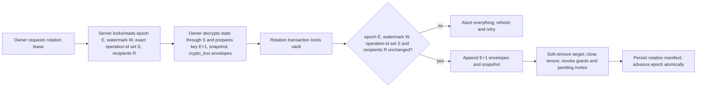

# P07 Implementation Evidence — Revision 04

## Immutable no-code boundary

- Package/revision/scope: `P07` / `04` / HS-011 architecture with integrated HS-012 correction.
- Original package BASE: `fe1871ce7dce1e831b57ee5656d38ce5c800aae3`.
- Required unchanged pre-implementation HEAD: `dfffea3c19b110b6021b050b8d9e36b01ae75ab9`.
- Allowed implementation paths: none. No product, test, migration, configuration, dependency,
  ledger, prior artifact/review, scratch, frozen source, SCOPE or agent path may change.
- Sole worker write: `specs/007-human-scratch-completion/evidence/P07/implementation-04.md`, created
  before further evidence work, intentionally uncommitted.
- At dispatch, the index and untracked set were empty. Git-visible dirt was exactly root-owned
  unstaged `HANDOFF.md` and `PROGRESS.md`.

## Correction plan

1. Preserve the independently accepted linked-hybrid architecture and every unaffected revision-01
   P08 clause.
2. Preserve revision 03's accepted cross-tab fence, but close F-001 by assigning every distinct
   peer-specific Loro update its own stable exact operation identity, retaining each update, and
   separating those identities from semantic saga completion.
3. Bind each repair round to observed exact claim-operation ids plus an imported causal frontier so
   a late claim forces a new causally newer permanent round; close F-002 by linking the canonical
   `person-default-me` from the initial snapshot to the returned owner membership in place.
4. Make creation, onboarding, schema/backfill/reversal, threat/privacy and test requirements
   executable and map every revised clause to proof.
5. Recheck formatting, frozen sources, workspace/HEAD/index boundaries and cleanup; do not claim
   review PASS or P08 dispatch readiness.

## Revision outcome

This revision preserves canonical Q-014 and closes both revision-03 findings without changing the
selected architecture:

- **F-001 is corrected:** an active member never discards an old epoch key until every locally
  durable, unpushed operation from that authorization tenure is classified against the rotation's
  permanent-operation set, re-encrypted under the current key, durably persisted, published with its
  same exact operation id, and acknowledged as either exactly covered or newly inserted. A local
  journal contains ciphertext references and state only; keys and plaintext operations remain
  memory-only and are zeroized. A persistent local fence serializes every edit admission and
  encrypted append with transition seal/adoption, so an edit cannot appear after enumeration as an
  unmapped source-epoch operation.
- **F-002 is corrected:** the server performs no CRDT Person mutation. A bearer-bound read lets the
  client authenticate the real vault key and current snapshot before mutation; one SQL transaction
  establishes durable membership/acceptance truth; then a reconstructible client saga creates or
  links one deterministic encrypted Person, persists selection and syncs before showing success.
  Default-vault creation has the same reconstructible two-boundary treatment: stable server creation
  truth returns the owner membership UUID and the client durably/synchronously links the existing
  canonical `person-default-me` without changing its ownership/references before success.
- **F-003 is corrected:** encrypted claim records converge first; a deterministic post-merge repair
  preserves the intended financial Person and its winning reciprocal membership, moves each losing
  membership to its own deterministic fallback Person, and remains `Finishing setup` until the
  repaired bijection is durable and synced.
- **Revision-03 F-001 is corrected:** semantic creator/acceptance/repair ids never alias CRDT
  operations. Each exact update emitted by each Loro peer is durably assigned its own id, retained
  in the permanent stream and acknowledged only by exact retransmission. Repair rounds include the
  observed claim-operation set and imported causal frontier, making post-repair late claims produce
  a new causally later round.
- **Revision-03 F-002 is corrected:** creator reconciliation links the existing vault-scoped
  `person-default-me`; it never creates a UUIDv5 owner Person. The default account's 100% ownership
  and all Person references remain byte/identity coherent.
- **Onboarding is decided:** invite-aware first-user registration defers default-vault creation.
  Successful acceptance selects the shared vault; explicit cancellation or terminal invalidity
  resumes ordinary default-vault creation exactly once.

Revision 01's current-state trace and installed-CLI observations remain accurate and immutable. The
independent review accepted the linked-hybrid direction, terminology, member-only governance,
sender-bound fragment capability, stable membership identity, display privacy and clauses not named
below. This artifact restates the full corrected contract so P08 does not need to combine an unsafe
clause from revision 01 with this correction.

This artifact does not claim review PASS. P08 remains unavailable until revision 04 independently
passes and the D-011/P05 genuinely-hidden-topology gate is rechecked successfully.

## Retained architecture decision

### Status and selection

`Proposed for independent P07 revision-04 review.` The selected architecture remains **linked
hybrid**:

- `Vault Settings > Access & Members` is the sole authoritative membership/invite surface.
- People remains the financial allocation/settlement surface. It may display an optional membership
  link/status and an authorized `Manage access` deep link, but Person edit/delete never grants or
  revokes access.
- **Person** means an encrypted financial record, **Member** means a server-authorized identity with
  a vault-key envelope, and **Invite** means a single-use bearer capability.
- Only member invitations and member removal ship in P08. Owner promotion, transfer, demotion and
  removal remain out of scope; existing additional owners are visible but immutable. Standalone
  `vault.leave` is deprecated/rejected or becomes an owner-actionable request until it can invoke
  the same rotation protocol.
- Person linkage uses stable vault-scoped membership UUID, not a displayed global pubkey hash.
  Optional profile labels live only in encrypted CRDT data and never authorize access.

The dedicated-settings-only option still misses HS-012's financial association, while People-owned
access still conflates financial history with cryptographic authority. The linked hybrid remains the
narrowest reversible, least-privilege answer to the frozen wording.

### Corrected consequence

The SQL-owned portion of removal—new snapshot metadata/ciphertext, per-recipient envelopes,
membership status, epoch, grants and invites—can be atomic. Locally unpushed encrypted operations
cannot be part of that server transaction; continuously active clients reconcile them through the
lossless transition below. Likewise, SQL acceptance and encrypted CRDT Person/link state are two
durable boundaries joined by a resumable saga, not one transaction.

A removed member may retain plaintext/key material it downloaded while authorized. P08 must say
removal prevents future access, not that past copies are erased. It must not grant that member—or a
later reactivation tenure—any historical envelope it could not access while continuously active.

## Protocol ownership and storage model

| Record/state                        | Durable owner      | Required fields and authority                                                                                                                                                      | Plaintext boundary                                    |
| ----------------------------------- | ------------------ | ---------------------------------------------------------------------------------------------------------------------------------------------------------------------------------- | ----------------------------------------------------- |
| Vault epoch head                    | server SQL         | `vault_id`, monotonic `current_epoch`, monotonic operation watermark and permanent-operation-id-set digest; mutations lock the vault row                                           | Identifiers/counters only                             |
| Membership tenure                   | server SQL         | stable `membership_id`, derived identity hash, role, recipient X25519 public key, monotonic `access_generation`, `active_from_epoch`, nullable `removed_at`/`active_through_epoch` | No name/profile                                       |
| Per-epoch key envelope              | server SQL         | `(membership_id, access_generation, epoch)`, authenticated-box version, authoritative sender and recipient X25519 public keys, ciphertext                                          | Vault key remains encrypted                           |
| Epoch snapshot                      | server SQL         | epoch, ciphertext, version vector, snapshot watermark, exact permanent operation-id-set digest, rotation id                                                                        | CRDT snapshot remains encrypted                       |
| Permanent exact operation           | server SQL         | generated-once `exact_operation_id`, epoch, sequence, peer/frontier/version-vector metadata, ciphertext digest and encrypted exact Loro bytes; source id across rotation           | CRDT update remains encrypted                         |
| Rotation manifest                   | server SQL         | rotation id, from/to epochs, exact covered permanent operation-id set/digest, watermark, recipient set and resulting snapshot id                                                   | No CRDT plaintext                                     |
| Invite                              | server SQL         | route UUID, epoch, invite X25519 public key, domain-separated capability-signing public key, sender metadata/envelope, encrypted Person intent, expiry/status                      | Secret and Person intent remain unavailable           |
| Acceptance truth                    | server SQL         | unique invite/attempt, caller-derived membership UUID, access generation, vault/epoch/snapshot binding, encrypted intent, reconciliation claim/status                              | No Person/name plaintext                              |
| Local operation/cache               | IndexedDB          | exact operation/transport ids, epoch, peer/frontier/version vector, ciphertext/digest, pushed flag; snapshot epoch/watermark                                                       | No operation/snapshot plaintext at rest               |
| Local edit-admission fence          | IndexedDB          | vault/current/minimum-admissible epoch, phase, monotonic fence/journal revisions, transition id; co-transactional with every local encrypted append                                | No update plaintext or key                            |
| Epoch transition journal            | IndexedDB          | transition id/state, membership/access generation, source/target epochs, snapshot/manifest binding, old exact operation ids, replacement transport ids, covered/publish/ack states | No key, decrypted update, Person/name or fragment     |
| Acceptance saga journal             | IndexedDB          | acceptance/membership/vault ids, stage, deterministic Person/link ids, reconciliation op id/ack and selection status                                                               | No fragment, key, plaintext Person intent/name        |
| Semantic saga/round receipt         | SQL + IndexedDB    | creator/acceptance/repair semantic id, frontier commitment and set of permanent exact operation ids; never substitutes for operation acknowledgement                               | No CRDT value/plaintext                               |
| Default creator truth/saga          | SQL + IndexedDB    | caller/purpose/attempt, stable vault and owner membership UUID, opaque canonical initial snapshot binding; peer-specific exact link operation ids/stages                           | Server never sees vault key, Person or name plaintext |
| Encrypted Person claim/repair       | CRDT + IndexedDB   | claim exact operation ids, reciprocal winner, observed claim-id set, imported causal frontier, repair round and exact emitted operation ids                                        | Server sees only encrypted op/opaque commitments      |
| Active vault keys/decrypted updates | client memory only | branded key material unwrapped from authorized envelopes; exact Loro bytes only while importing/re-encrypting                                                                      | Zeroized/dropped at transition/acceptance boundaries  |

`crypto_box` authenticated sender/recipient envelopes are the sole P08 vault-key-envelope
convention. P08 removes the sealed-box alternative from revision-01 clause 17. Capability proof is
an Ed25519 signature derived domain-separately from the fragment secret; it is proof, not a key
envelope. All primitives use libsodium, exact length/version validation and client-side key
handling.

### Continuous-authorization rule

Historical-envelope reads require all of these:

1. the signed caller maps to the exact membership row;
2. that row is active (`removed_at IS NULL`);
3. the requested envelope belongs to the row's **current** `access_generation`; and
4. the requested epoch lies within that uninterrupted generation's active interval.

Removal closes the interval and denies all subsequent envelope fetches, including old epochs. Safe
reacceptance preserves `membership_id` for Person history but increments `access_generation` and
creates only a current-epoch envelope. Thus a re-added identity does not reacquire keys from its
prior tenure. A member invited at epoch N has no envelope for epochs before N; it can read financial
history only through the authorized current snapshot.

Historical envelope rows are retained for an active generation because an offline device may hold an
arbitrarily old `pushed=false` operation. No garbage collection is allowed until a later reviewed
protocol can prove every device has no such ciphertext. Server export/reversal retains these rows;
their endpoint remains protected and least-field.

## Revision-04 exact CRDT-operation identity and semantic completion

### Two identities with different authority

P08 must never use one identifier for both a desired outcome and a Loro operation. It uses:

- a **semantic saga/round id** for the idempotent creator attempt, acceptance attempt or one repair
  frontier. It says which outcome is being completed and prevents duplicate SQL/entity intent, but
  it does not prove any CRDT bytes are permanent; and
- an **exact operation id** generated once inside the durable admission transaction for each actual
  incremental Loro update exported by one peer/fork. It identifies those peer/counter/causal bytes,
  even when another peer assigns identical JSON values. Distinct exported bytes always receive
  distinct exact operation ids and both remain permanent.

An admitted row contains `exact_operation_id`, generated-once transport id, author membership/
device id, source epoch, Loro peer metadata/version vector/imported frontier, encrypted exact
update, authenticated ciphertext digest and `pushed=false`. The local row is immutable except for
monotonic publish/ack/epoch-transition state. The exact bytes and ciphertext are reused on ordinary
retry; the client never regenerates an allegedly equivalent update. A transition may re-encrypt the
same stored update under a new authorized key, but it preserves `exact_operation_id`, records the
source row and obtains the revision-03 manifest `covered`/current `inserted` result before cleanup.

The server enforces one row per `(vault_id, exact_operation_id)`. A first append stores the opaque
metadata and ciphertext. A repeated id is acknowledged only when its signed author/source binding,
epoch form, version-vector/frontier metadata and ciphertext bytes/digest are the exact permitted
retransmission; it returns the stored row/ciphertext for client verification. Any same id with
different bytes or metadata is an operation-id collision and remains unacknowledged. The server does
not compare decrypted updates or infer same-value equivalence. `covered` is legal only when the
rotation manifest proves that exact operation id is in its permanent source set; another peer's
same-value update, a matching semantic saga id, or matching map/entity keys can never cover it.

Semantic completion is a separate monotonic receipt. It names the creator/acceptance/repair id, the
opaque frontier/claim-set commitment where applicable, and a set of exact operation ids the client
has proved permanent. Concurrent peers may each emit a different operation for the same semantic
outcome; completion expands to include every reported exact id, and every emitting client remains
`Finishing setup` until its own durable row is permanent or pulled as those exact bytes. Entity/map
keys make repeated assignments converge without duplicate People; the receipt never licenses
deletion of an unpushed update. Startup scans all local rows independently of completion receipts,
so a completed saga cannot strand a later-discovered local operation.

### Exact response-loss and peer proof

For two peers starting at the same authenticated snapshot and assigning the same values, the
required test fixes different Loro peer ids, exports both incremental updates and first asserts the
bytes are unequal. Each admission gets a different exact operation id. Response loss is injected
after each server insert but before either acknowledgement; reload retransmits each stored
ciphertext/id rather than re-emitting assignments. The server and both reloaded clients must contain
both exact operations, each local row is `pushed=true/permanent`, importing both is idempotent, and
the semantic receipt references both ids. This matrix runs for creator linkage, same-acceptance
duplicate assignments and same-round repair emitters. Equal current JSON is insufficient evidence;
byte/id permanence, peer version vectors and zero unpushed rows are asserted.

## F-001 correction — lossless epoch transition

### Server rotation preparation and commit

Exact operation identity closes the acknowledgement-race hole without aliasing peers. A normal
operation receives generated-once exact/transport ids at admission. Re-encryption changes its
ciphertext/epoch transport form but retains that exact id and source binding. Server uniqueness on
`(vault_id, exact_operation_id)` prevents response-loss duplication of those bytes, while distinct
peer updates always have distinct ids and are all retained.



The preparation response contains a short-lived rotation id, current epoch, server-assigned
operation watermark, exact permanent operation-id set or a canonical digest plus membership-proof
endpoint, current snapshot binding, exact active recipients/public keys and pending invite set. The
owner materializes a complete Loro document from the authenticated snapshot plus every permanent
operation through that set, creates a fresh 32-byte key, encrypts the epoch+1 snapshot and wraps it
for every remaining active recipient with authenticated `crypto_box` using the owner's authoritative
sender key.

The commit transaction serializes with `append_vault_ops` on the vault row. It verifies the exact
epoch, watermark, permanent operation-id set/digest, active recipient/access-generation set, target
member and pending-invite set. On success it appends—not overwrites—epoch+1 envelopes, records the
snapshot/manifest, soft-removes only the member target, closes that access generation, revokes its
Realtime grants, revokes every pending invite and advances the epoch. Any operation appended before
the transaction changes the watermark/set and aborts rotation; after the advance, an old-epoch
append is rejected. There is no timing window in which an accepted permanent old operation is absent
from both the snapshot and manifest.

### Revision-03 persistent edit-admission and append fence

Revision 02 correctly preserved enumerated operations, but enumeration alone did not exclude a stale
sibling tab from durably appending another source-epoch operation. The governing P08 design
therefore has exactly one local mutation path. A UI/domain edit is first applied to an isolated fork
of the authenticated Loro document to obtain the exact update bytes; it does **not** mutate the live
document yet. The client encrypts those bytes in memory and opens one read-write IndexedDB
transaction spanning `vaultEpochFences`, `localOperations`, `editAdmissions` and
`epochTransitionJournals`. That transaction reads and compare-and-swaps the persisted vault fence
and chooses exactly one branch:

1. **Open at expected epoch E.** Atomically append ciphertext, epoch E, a generated-once exact
   operation id, version vector and `pushed=false` admission. Only after that commit may the exact
   update bytes be imported into the live document, with subscriber-derived persistence suppressed.
   A crash after commit/before import reloads and imports the durable row; a crash before commit has
   neither a live mutation nor success UI.
2. **Sealed E toward T, before adoption.** Atomically extend/reopen the same transition journal with
   this exact encrypted update, source exact operation id and generated-once target mapping,
   increment its `journal_revision`, and leave the live document unchanged. The transition
   materializer imports and re-encrypts it under T. There is no standalone late E row outside the
   journal.
3. **Terminal/current T or any expected-epoch mismatch.** Refuse an E append. Authenticate the
   current envelope/snapshot, then retry the unchanged isolated Loro update bytes through the open-T
   admission transaction. Until current-epoch durability succeeds the live document remains
   unchanged and the UI remains `Updating vault security`; an old row can never be published.

The fence is a per-vault durable record containing `local_epoch`, `minimum_admissible_epoch`, phase
(`open`, `sealed`, `transitioning`, `terminal`), monotonic `fence_revision`, transition id/source/
target epochs and monotonic `journal_revision`. `terminal` is a durable receipt for E even after T
becomes the new open epoch. All local edit APIs—including undo/redo, imports that represent a user
edit, background rules and acceptance/creator/repair operations—must use this admission path. Remote
sync/snapshot imports use a separately tagged persistence-suppressed path. The old live-mutation
subscriber-to-append path is removed before P08 enablement; Web Locks, BroadcastChannel and leader
election only schedule/wake work and are never correctness authority.

The planning transaction serializes on the same IndexedDB stores. It compare-and-swaps `open E` to
`sealed E -> T`, records the exact fence revision, enumerates every source-epoch `pushed=false`
operation/admission, and places each exact operation id in the journal. IndexedDB write-transaction
serialization gives the exhaustive race proof:

- an admission transaction commits before sealing and is necessarily visible to enumeration;
- sealing commits first and the admission necessarily reads `sealed`, so it atomically extends the
  journal before any live adoption; or
- terminal adoption commits first and the stale tab is forced through current-epoch admission.

There is no callback suspended across a transaction and no check-then-append gap. The leader
materializes a captured journal revision. Every extension invalidates that capture. The adoption
transaction again spans the four stores and succeeds only if transition/fence/journal revisions
still match, every source row/admission is mapped, every mapping is `covered` or `inserted`, and no
deferred/unmapped exact operation remains. It then saves the authenticated T snapshot, advances
`local_epoch` and `minimum_admissible_epoch`, and records the terminal E receipt atomically. A late
extension makes the compare-and-swap abort and materialization resumes. Cleanup may remove only
acknowledged source ciphertext after terminal durability; cleanup never removes the terminal fence.

Thus the exact no-late-operation invariant is: at the adoption commit there is no locally durable
source-epoch mutation outside the sealed journal, after it no transaction can append or publish
below `minimum_admissible_epoch`, and every edit admitted on either side of the race reaches the
current document exactly once by its exact operation id. This invariant is local-persistence based;
tab messaging can be lost indefinitely without weakening it.

### Remaining-client transition state machine

The sync manager sends epoch on every snapshot/op request and publish. `EPOCH_ADVANCED` is a typed
response, never a generic retry. Once observed, every tab stops old-epoch publication, displays a
non-success `Updating vault security` state, and enters the persistent fence protocol above.
Non-leaders may observe IndexedDB/BroadcastChannel state but each append still proves the fence in
its own transaction.

```mermaid
stateDiagram-v2
    [*] --> observed: current server epoch is newer
    observed --> planned: journal + complete old unpushed exact operation-id set durably captured
    planned --> authenticated: active-generation old/current envelopes and current snapshot authenticate
    authenticated --> materialized: each uncovered old update is exactly re-encrypted and durably mapped
    materialized --> publishing: only current-epoch replacements are sent
    publishing --> adopted: every exact operation id acknowledged; current snapshot plus replacements saved
    adopted --> complete: local epoch switches; old ciphertext cleaned; old key zeroized
    observed --> denied: membership no longer active
    denied --> [*]: retain old local data; no publish/new envelope
```



State requirements:

1. **Observed.** Stop old publication and seal via the transactional fence above. Persist source
   epoch(s), target epoch, membership/access generation and transition id before key conversion. If
   offline, keep all ciphertext and wait; edits remain isolated until admitted to the sealed
   journal.
2. **Planned.** The sealing transaction enumerates every `pushed=false` operation/admission below
   target, records each exact operation id and generated-once replacement transport id, and binds
   the journal to target snapshot/manifest. A racing edit is included before seal or increments the
   same journal after seal; reopening/retrying preserves the mapping.
3. **Authenticated.** Through the signed, least-field envelope endpoint, fetch only this active
   generation's required source envelope(s) and current envelope. Unwrap keys in memory, verify
   sender/recipient/version/epoch, authenticate the target snapshot and ask the immutable manifest
   membership endpoint which exact local operation ids were already permanent at rotation.
4. **Materialized.** For **every** old `pushed=false` operation, decrypt the ciphertext with its
   source-epoch key, import the exact same Loro update bytes into the authenticated target snapshot,
   encrypt those same bytes with the target key and preserve its version vector/exact operation id.
   Persist the generated-once replacement transport id, target-epoch ciphertext and journal state
   atomically, even when the manifest says that exact id already became permanent during an
   acknowledgement race. Plaintext/key bytes never enter the journal.
5. **Publishing.** Send every persisted target/current-epoch replacement. Server active-generation/
   current-epoch checks and unique exact id return one of two durable acknowledgements: `covered`
   when that exact id was already in the rotation snapshot, or `inserted` when the current-epoch
   replacement becomes its sole permanent row. A crash after insert but before local acknowledgement
   retries the same transport/exact id/ciphertext and receives the same result. The original old row
   is not deleted or marked superseded until the replacement is durable and its exact id is
   acknowledged.
6. **Adopted.** Pull current-epoch operations after the watermark and import replacements. The
   adoption transaction proves matching fence/journal revisions, zero deferred/unmapped source
   operation ids and durable acknowledgement for every mapping, then persists the authenticated
   snapshot, target epoch/minimum-admissible epoch and terminal source receipt. Edits may then be
   admitted at T.
7. **Complete.** Persist a compact non-secret completion receipt, then remove superseded old local
   ciphertext and zeroize all source-epoch keys. Envelope history remains server-side for other
   devices in the same active generation. If the vault advances again mid-transition, preserve the
   journal and repeat toward the newest epoch; never delete an intermediate source until its exact
   id is permanent under the newest target.

The removed target follows the `denied` branch: it receives no new envelope/snapshot/Realtime grant,
cannot fetch old envelopes after tenure closure, and cannot publish old operations. Its pre-removal
local ciphertext/key may remain readable as the honest past-copy limitation, but the server grants
no historical or future capability it did not already possess.

### Crash/idempotency proof obligations

| Injected boundary                                   | Durable recovery invariant                                                               |
| --------------------------------------------------- | ---------------------------------------------------------------------------------------- |
| isolated edit before admission transaction          | live document and durable log are unchanged; action retries                              |
| admission commit before live import                 | ciphertext/exact operation id exists once; reload imports exact bytes                    |
| live import after durable admission                 | suppressed subscriber cannot create a second append                                      |
| edit append commits immediately before seal         | shared-store serialization makes sealing enumerate it                                    |
| seal commits immediately before edit append         | edit reads sealed and atomically increments/extends the journal                          |
| before journal creation                             | untouched old ciphertext remains; detection restarts                                     |
| after journal, before envelope fetch                | source ids/mappings remain; active caller refetches least-field envelopes                |
| after key unwrap/snapshot decrypt                   | no plaintext/key is durable; reload unwraps again from authorized history                |
| between classification records                      | one IndexedDB transaction per mapping resumes the first incomplete exact operation       |
| after replacement encryption, before local put      | old ciphertext remains authoritative; replacement is regenerated with the stored id      |
| after local put, before publish                     | current ciphertext/mapping is durable and retransmitted by exact id/bytes                |
| after server insert, before local ack               | exact retry returns stored row; other peer ids remain independent                        |
| journal extension during materialization/adoption   | revision mismatch aborts adoption; new exact operation is materialized                   |
| after all acks, before snapshot/local-epoch switch  | mappings, acknowledgements and sealed fence rebuild the same current document            |
| stale tab attempts E append after terminal adoption | persisted minimum epoch rejects E; exact isolated update is re-admitted once at T        |
| after local switch, before cleanup/zeroization      | terminal fence is monotonic; cleanup repeats without deleting current data               |
| concurrent old server append                        | shared vault-row serialization changes set/watermark; rotation aborts and owner rebuilds |
| second rotation during transition                   | prior journal/ciphertexts remain; active envelope history allows a new target transition |

No transition state may contain plaintext operations, vault keys, fragments, recovery material or
Person names. Storage-unavailable mode may not silently fall back to memory for a security
transition: it remains blocked with old ciphertext preserved until durable journal storage is
available.

The required real-browser proof uses two genuine tabs against one vault and the real sync/server
stack. A deterministic native IndexedDB transaction blocker/barrier controls ordering only; it does
not call a service method, inject rows, bypass UI, or substitute a fake coordinator. Both tabs make
visible UI edits on both sides of sealing. The test proves: the before-seal edit is enumerated and
applied once; the after-seal edit extends the journal and is applied once; a close/reload at each
admission, seal, extension, publish, adoption and cleanup boundary resumes; a stale tab after
terminal cannot create/publish an E row and re-admits its exact update at T; no source operation,
admission or deferred exact id remains. It inspects authenticated UI/document outcomes plus allowed
IndexedDB/server metadata, uses event/barrier assertions rather than sleeps, and runs both race
orders repeatedly. Lower-level integration tests may inject a persistence adapter for every
boundary, but they cannot replace this multi-tab proof.

## F-002 correction — capability read and acceptance saga

### Fragment-derived keys and pre-membership read

Invite creation derives two independent keypairs from the same exact 32-byte fragment secret with
distinct fixed domains:

- an X25519 invite recipient pair for the owner's authenticated `crypto_box` vault-key envelope;
- an Ed25519 capability-signing pair used only to prove secret possession during acceptance.

Only public keys are stored. The raw fragment secret and both derived secret keys stay client-side.
The protected identity still signs the complete P04 mutation; the capability signature is an
additional one-time proof and cannot select actor, vault or role.

The minimum pre-membership endpoint accepts only route invite UUID plus the derived invite X25519
public key. For an exact unexpired/unrevoked/unconsumed/current-epoch pair it returns:

- envelope version, epoch, authoritative sender X25519 public key, invite recipient public key and
  encrypted real vault-key envelope;
- opaque current snapshot id, encrypted snapshot, version vector, server watermark and digest of the
  permanent exact operation-id set;
- a short-lived one-use acceptance challenge required for secret-possession proof.

It returns no vault id/name, roster, identity hash, creator label, role choice or plaintext Person
intent; the opaque encrypted intent remains on the locked invite and is copied only into acceptance
truth after SQL success. Responses are `no-store`, rate-limited and redacted from
procedure/request/error logging. Absent, malformed-key, UUID-only enumeration, expired, revoked,
consumed, stale-epoch and substitutions across vaults produce the same generic external result and
comparable response shape/timing. Possession of the exact pair reveals ciphertext size, expiry and
activity watermark to the intended bearer; the UI warns that the link is a bearer capability. It
reveals no plaintext.

The client opens the authenticated owner-to-invite envelope, requires exactly 32 key bytes, and
authenticates the returned snapshot before SQL mutation. It signs a canonical tuple containing
invite UUID, both stored capability public keys, challenge, epoch, snapshot id/watermark/digest,
caller identity hash, caller recipient X25519 public key, self-envelope digest and
acceptance-attempt UUID with the derived capability Ed25519 secret. The server verifies this
signature against the invite row. A leaked database public key or derived lookup value cannot
consume an invite without the fragment-derived signing secret.

The fragment remains in a fragment-only URL, masked, until durable SQL acceptance truth exists; this
is the only crash-safe way to retry a pre-SQL failure without persisting the bearer secret. It is
never sent raw. Immediately after the transaction is confirmed—or a protected pending-acceptance
read proves it committed—the client clears the fragment with `history.replaceState` and zeroizes the
fragment/invite secret keys. Before that boundary, reload restarts preflight from the fragment;
after it, reload resumes from membership/acceptance truth and the self-wrapped current key.

### Atomic SQL acceptance truth

```mermaid
sequenceDiagram
    participant C as Invitee client
    participant P as Capability read
    participant S as SQL accept transaction
    participant L as Local encrypted CRDT saga
    C->>P: invite UUID + derived X25519 public
    P-->>C: sender/envelope + encrypted snapshot/watermark + challenge
    C->>C: unwrap real key; authenticate snapshot; self-wrap; capability-sign tuple
    C->>S: identity-signed accept + capability proof + prepared binding
    S->>S: lock invite, vault, snapshot, membership; verify exact epoch/binding/proof
    S->>S: consume invite; create/reactivate membership; append self-envelope; write acceptance truth
    S-->>C: stable membership/access generation + vault/current binding + reconciliation required
    C->>L: resume deterministic Person/link/selection/sync
```

The transaction is the only acceptance authority. It:

1. locks the exact UUID/invite-public-key/challenge row, vault epoch/current snapshot and caller's
   membership row;
2. verifies expiry/status, current epoch and prepared snapshot watermark/digest, the P04-derived
   caller, exact encodings and capability signature;
3. creates a new stable membership or reactivates the same membership UUID with incremented access
   generation, member role and caller self-wrapped current key; it never promotes an owner;
4. consumes the invite/challenge and writes an immutable acceptance row keyed by invite and
   acceptance-attempt UUID, retaining only the opaque encrypted Person intent; and
5. returns membership UUID, access generation, vault id, epoch/snapshot binding and
   `reconciliation_required`.

If snapshot/epoch changed after preflight, the whole transaction returns typed stale-preflight and
leaves the invite unconsumed; the client refetches and reauthenticates. Same-caller/same-attempt
retry after a lost response returns the existing truth. Another caller, attempt substitution, replay
or consumed-link lookup receives the generic invalid result. A protected, caller-derived
`pendingAcceptances` read reconstructs committed-but-unfinished work even when the originating local
journal was never written.

The transaction does **not** create, link, select or claim to roll back a CRDT Person.

### Deterministic client reconciliation saga

```mermaid
stateDiagram-v2
    [*] --> sqlAccepted: acceptance truth exists
    sqlAccepted --> vaultAuthenticated: own envelope + current snapshot authenticate
    vaultAuthenticated --> linkDurable: one encrypted CRDT transaction is durably journaled
    linkDurable --> linkSynced: semantic link op is server-acknowledged or already present
    linkSynced --> selectionDurable: shared vault selection persists
    selectionDurable --> reconciled: protected acknowledgement; local proof complete
    reconciled --> [*]
```



Every authenticated app load checks protected acceptance truth before normal vault success UI. The
local journal is an optimization; server truth plus membership self-envelope and encrypted intent
can reconstruct it. The saga remains visibly `Finishing setup` until all stages complete.

1. **SQL accepted.** Persist/recover the acceptance id, membership id/access generation and vault
   binding. Clear/zeroize the fragment boundary as above. Offline operation now means retry later,
   not cancellation or default-vault creation.
2. **Vault authenticated.** Unwrap the membership's current self-envelope, authenticate the current
   snapshot and process any intervening epoch through the F-001 transition. Decrypt the opaque link
   intent client-side.
3. **Link durable.** Use encrypted CRDT maps keyed by `membershipId`. A link intent naming a valid
   unlinked Person selects that id; otherwise derive the new Person id deterministically from
   `(vaultId, membershipId)` using a fixed UUID namespace. One Loro transaction upserts the Person
   with `linkedMembershipId`, `membershipLinks[membershipId] = personId` and the reciprocal
   claim/map; it never creates a second random Person. Distinct claims converge and automatically
   enter the deterministic post-merge repair below rather than remaining repair-required. Persist
   the encrypted update through the fenced admission transaction before treating it as durable.
4. **Link synced.** Push each peer's durably stored exact reconciliation operation under the current
   epoch. Retry retransmits that exact id/ciphertext; concurrent same-value assignments have
   distinct ids and all become permanent. Deterministic keys make same-membership assignments
   converge to one Person; different-membership contention runs frontier-bound repair. The separate
   acceptance completion receipt prevents duplicate semantic work but never drops a peer operation.
5. **Selection durable.** Persist the accepted shared vault as the originating device's active vault
   only after its local document contains the canonical link. Reload validates both selection and
   link before advancing.
6. **Reconciled.** After the link operation is server-acknowledged (or pulled as permanent) and
   selection is durable, send a signed reconciliation acknowledgement referencing the set of exact
   permanent operation ids and current frontier. The server verifies existence, not encrypted
   content. The client independently verifies one link/Person before showing success. All later
   loads still perform the idempotent invariant check; a global acknowledgement never suppresses
   device-local validation.

Crashes before the combined CRDT Person/link transaction leave no Person. Crashes after local
durability retransmit the stored exact update/id. Crashes after server sync but before local ack
pull and verify that exact permanent operation. Concurrent tabs may emit unequal operations; all are
retained while deterministic entity keys converge. Crashes around selection reapply the same vault
id. Ambiguous legacy links remain preserved for explicit repair and are never auto-merged/deleted.

| Injected acceptance boundary                                         | Durable recovery invariant                                                                  |
| -------------------------------------------------------------------- | ------------------------------------------------------------------------------------------- |
| before SQL transaction                                               | invite remains usable unless protected truth proves the transaction committed               |
| after SQL commit, before response/local journal                      | `pendingAcceptances` reconstructs the same membership/acceptance; no second consume         |
| after current-key/snapshot authentication                            | no plaintext/key is durable; membership self-envelope permits retry                         |
| during Person field write, before link field/CRDT commit             | no encrypted update or saga advance is durable; deterministic transaction restarts          |
| after combined Person/link CRDT commit, before IndexedDB transaction | in-memory partial state is disposable; reload deterministically emits both fields again     |
| after encrypted Person/link op and journal commit, before push       | each durable exact id/ciphertext resumes without regeneration                               |
| after server operation insert, before local acknowledgement          | exact stored bytes/id are observed; other peers' operations remain independently pending    |
| after link sync, before vault selection                              | selection persists on resume only after link invariant recheck                              |
| after selection, before reconciliation acknowledgement               | same vault id remains selected; signed acknowledgement retries                              |
| after acknowledgement, before success render                         | every load rechecks vault, canonical link, permanent exact ids/frontier and local selection |
| concurrent tabs at any stage                                         | per-acceptance lock serializes locally; deterministic CRDT keys converge if leaders race    |

### Deterministic invite-aware onboarding

- New-user navigation carries only the route/secret in the URL fragment. Registration creates the
  P06 identity-only row but **does not call default-vault creation** while an invite is pending.
- After unlock/registration, preflight and acceptance run. Successful reconciliation selects the
  shared vault and enters it; no personal vault is orphaned.
- Explicit pre-SQL cancellation or a confirmed terminal invalid/expired/revoked result clears and
  zeroizes the fragment, exits invite mode, invokes ordinary idempotent default-vault creation once
  and selects it. A transient offline/server/finishing error does not create a default vault.
- After SQL acceptance there is no invitation cancellation: membership is durable and the UI offers
  retry/resume `Finishing setup`. Any later leave/removal follows the reviewed member-removal flow.
- Existing-user unlock preserves the fragment client-side, returns to preflight and never converts
  it into a query parameter, server component value, log or referrer.

### Revision-04 canonical default-vault creator-to-owner linkage saga

Default-vault creation is a separate reconstructible two-boundary protocol; listing then creating is
not its idempotency authority. Before the request, the client durably creates a non-secret
`creatorSaga` attempt for fixed purpose `initial-default` and prepares the real vault key, owner
authenticated self-envelope and encrypted initial snapshot. The server runs one transaction keyed by
`(caller_pubkey_hash, initial-default)`, with the caller attempt as an alias. A uniqueness
constraint makes every concurrent/repeated default-creation attempt for that identity resolve to one
truth. That transaction creates exactly one vault and stable owner `membership_id`, stores the
owner's current-generation envelope and the opaque epoch-0 initial snapshot/binding, and records
immutable creation truth containing caller, purpose/attempt aliases, vault id, membership UUID,
access generation and snapshot binding. It returns that truth on retry. Explicit user-created
additional vaults use a different purpose and idempotency key and are not coalesced. Every new-vault
entry point nevertheless uses the same canonical initial snapshot validation and post-truth
`person-default-me` owner-link rule; there is no older create/snapshot path that may skip the
reference or exact-operation gates.

The server validates caller ownership, envelope version/sender/recipient public keys, exact
ciphertext bounds and snapshot metadata, but never receives a vault key, decrypted CRDT, Person name
or financial field. `pendingCreations` is a protected caller-derived least-field read of unfinished
creation truth, so a lost SQL response or local journal is recoverable. The SQL transaction is
all-or-nothing: a crash before commit leaves no vault/membership/snapshot; after commit it
reconstructs the same vault, membership and opaque snapshot.

The opaque initial snapshot is the established canonical constructor output. Before creation it is
locally authenticated to contain exactly one active `person-default-me`, the active
`account-default`, and `account-default.ownerships = { "person-default-me": 100 }`; every other
Person reference is enumerated and must either be absent (normal new snapshot) or point to that same
id. The snapshot binding stored in creation truth commits to this canonical initial state without
revealing it. Missing/malformed defaults, a second active Person, a dangling Person reference or
non-100% initial ownership blocks creation for explicit repair; the protocol never synthesizes,
merges, soft-deletes or silently reallocates a referenced Person.

After SQL truth returns `membershipId`, the client authenticates that same snapshot and in one Loro
transaction updates the existing `people["person-default-me"]` in place with
`linkedMembershipId = membershipId`, writes `membershipLinks[membershipId] = "person-default-me"`,
the reciprocal claim/winner, and `personMembershipLinks["person-default-me"] = membershipId`. It
does **not** derive or create a UUIDv5 creator Person. The id, `Me` name, `account-default` 100%
ownership, allocations and every reference remain unchanged. Each creator peer's exported link
update receives its own exact operation id through the fenced admission path; the stable creator
saga id is only the semantic completion key. Server truth plus the canonical snapshot/membership
reconstructs intent without local plaintext. The creator state machine is:

`attempt durable -> SQL vault/owner/snapshot truth -> owner link durable -> owner link permanent -> active selection durable -> complete`.

No caller observes creation success, enters the vault or clears unfinished truth before the owner
Person/link bijection and exact canonical reference invariant are in the authenticated local
document, every exact creator update emitted by that client is permanent, and active selection is
durable. A protected semantic completion receipt references permanent exact operation ids but cannot
attest to plaintext; every load independently checks the decrypted invariant. Invite-aware
onboarding defers this entire protocol until explicit cancel/terminal invite failure. Successful
invite acceptance never starts it.

| Injected creator boundary                  | Recovery/concurrency invariant                                                   |
| ------------------------------------------ | -------------------------------------------------------------------------------- |
| before local attempt durability            | no server call or success; retry creates one attempt                             |
| concurrent tabs choose different attempts  | SQL purpose uniqueness returns one creation truth and one vault/owner membership |
| before initial snapshot SQL commit         | atomic transaction leaves no vault, membership, envelope or snapshot             |
| after snapshot/SQL commit before response  | `pendingCreations` returns the same truth; no second vault                       |
| after response before local saga write     | truth reconstructs the canonical `person-default-me` link intent                 |
| before fenced owner-link commit            | no live Person/link mutation or success                                          |
| after owner-link durability before push    | each peer's exact `pushed=false` update/id resumes without regeneration          |
| after server insert before acknowledgement | exact ciphertext/id retry is acknowledged; no peer operation or Person is lost   |
| before/after active selection persistence  | selection follows link proof and repeats with the same vault id                  |
| repeat calls after completion              | existing truth and satisfying one-Person bijection return, never recreate        |

Real-browser coverage opens two fresh creator tabs for one identity, releases create calls
concurrently, loses both operation acknowledgements and one SQL response, and closes/reloads at each
snapshot/operation/selection boundary. It asserts the two peers' same-value link updates are
unequal, have distinct exact ids and both become permanent/pushed. Through normal
registration/unlock UI and real SQL/sync, it proves exactly one vault and owner membership; exactly
one active Person whose id is `person-default-me`; reciprocal links to the owner; `account-default`
ownership exactly 100% to that id; every Person reference resolves; no UUIDv5 duplicate; one
semantic completion receipt; and one selected vault. A second case crashes before/after atomic
initial-snapshot commit and rejects malformed defaults without mutation. Only opaque
ciphertext/metadata reaches the server. No service fixture, direct row insertion or hidden product
hook can satisfy this proof.

### Revision-04 frontier-bound convergent repair for distinct invitations claiming one Person

An encrypted `membershipPersonClaims[membershipId]` value records acceptance id, intended Person id
and its exact claim-operation id. An encrypted Person-keyed `personClaimWinners[personId]` is one
atomic reciprocal value `{membershipId, acceptanceId}`; Loro's deterministic register convergence
chooses one when offline/concurrent acceptances propose different memberships.
`Person.linkedMembershipId` and the two link maps are checked/repaired projections, not separate
authorization facts. SQL never reads Person ids or chooses a winner.

On every authenticated merge, startup, acceptance resume and before success, the client scans active
claims. For multiple active claims to one intended Person, it preserves that Person and all
allocations/history. The winner is the valid converged `personClaimWinners` membership; if malformed
legacy state has none, the deterministic fallback is the smallest `(acceptanceId, membershipId)`. It
restores that winner's forward/reciprocal projections. For each loser sorted by membership UUID, one
transaction:

1. removes/overwrites **only** the loser's forward claim to the intended Person;
2. creates/reuses `UUIDv5(P07_MEMBERSHIP_PERSON_NAMESPACE, vaultId || loserMembershipId)`, a
   schema-reserved deterministic fallback Person with encrypted display fallback;
3. writes loser membership -> fallback Person, fallback Person -> loser membership, its atomic
   winner value and `linkedMembershipId`; and
4. leaves the intended Person, winner claim and every financial/history field unchanged.

Migration collision-checks the reserved namespace before new writes; a legacy collision is preserved
for explicit migration repair, never overwritten. Every claim assignment is itself an exact
operation with its own permanent id. Before repair, the client pulls/imports permanent operations
through watermark W and records: the sorted exact claim-operation ids relevant to this Person, their
encrypted claim-set commitment, and the imported Loro causal frontier/version vector F. It derives a
**semantic repair-round id** from `(vaultId, personId, claimOperationIds, F, winner, sortedLosers)`
only to deduplicate that observed frontier. It then emits repair values after F, so Loro records a
causal dependency on all observed claims. Every repairing peer's exported bytes get a separate exact
operation id and all are permanently stored; same values never cover another peer's operation.

The round receipt names its claim set/frontier plus the set of permanent exact repair ids. A client
may complete only when its document frontier dominates every named claim and repair operation, the
server watermark has been pulled, every locally emitted row is permanent, and the bijection holds
after merge. The scanner emits no additional round for an already dominated identical claim
frontier, preventing value-only churn. If a stale/offline claim becomes permanent after round R, its
new exact claim id and causal version are absent from R; importing it changes F and necessarily
creates round R+1. R+1 is generated after that claim, has a new semantic round id and one or more
new exact permanent repair ids, so the earlier R acknowledgement can never masquerade as the
required causally newer write. An optional encrypted owner reservation may reduce races but is not
correctness authority.

An observed conflict remains or re-enters `Finishing setup` until every local claim/repair exact
operation is durable/permanent, the current claim frontier is dominated, the watermark is pulled and
the bijection recheck passes. Later offline claims trigger the causally newer round above; they
cannot leave permanent `repair-required`, be hidden by an old semantic receipt, or overwrite
financial history. Removal keeps Person/history; safe re-add of the stable membership UUID reuses
its Person.

The exact concurrency proof accepts two distinct real invitation URLs for two identities against one
real vault while both encrypted intents name the same existing financial Person. Calls and claim
publication are barrier-released in both orders; tabs exchange real CRDT updates. The test
closes/reloads before claim durability, after one/both inserts, after merge and around repair ack.
Both repairing peers emit unequal same-value update bytes and both exact ids become permanent. After
the first round is permanent/acknowledged, the test releases a third stale claim operation; all
clients import it, emit/observe a new frontier-bound causally later repair, and reload. It proves
every exact claim/repair id permanent with no unpushed row; two memberships/two active Persons; the
intended Person/history retained for the winner; one deterministic loser Person; consistent links;
no oscillation or permanent finishing; and no Person intent in SQL/logs.

## Revised complete P08 acceptance contract

All 29 clauses remain mandatory. Q-014 corrections remain intact; revision 04 specifically tightens
clauses 14, 16 and 22 for exact-operation identity, causal repair and canonical default references.
Every other clause and proof direction retains the sound revision-03 outcome.

### A. Authoritative surfaces and permissions

1. Vault Settings contains discoverable `Access & Members` on desktop/mobile. People copy describes
   financial participants and does not promise hidden invitation behavior.
2. Owners see safe active-member/pending-invite state and member-only create/copy/revoke/remove
   controls. Members see a privacy-safe roster and own role without mutations. Outsiders receive no
   roster. Direct member/outsider mutation is server-rejected.
3. Every protected mutation retains P04 signing and server-derived caller identity. Vault, role,
   target membership and invite authority come from locked rows, never client claims.
4. P08 invite/removal targets members only. Owner governance is excluded. Standalone insecure leave
   is rejected/deprecated or owner-coordinated through the same atomic rotation.
5. Endpoints return least fields and normalize absent/expired/revoked/tampered/unauthorized states
   so roster, invite, vault and identity enumeration do not result.

### B. Versioned real-key invitation

6. The fragment secret is exactly 32 libsodium-random bytes, unpadded base64url and never appears
   raw in request/path/query/server props/log/analytics/referrer/console/error/test artifact.
7. Creation stores exact-length/versioned authenticated `crypto_box` metadata using the sender key
   selected from the owner's membership plus the domain-separated capability-signing public key. The
   server does not trust caller-claimed sender identity.
8. Preflight/acceptance bind route UUID, derived invite X25519 public key, capability proof, current
   epoch and prepared snapshot. Tamper, cross-vault, replay and concurrent double acceptance fail
   closed without an oracle.
9. Invites wrap one explicit epoch. Epoch advance atomically revokes pending invites; owners issue
   fresh links instead of carrying bearer capabilities over a security-boundary change.
10. The minimum pre-membership endpoint and proof above return only sender/envelope plus encrypted
    current snapshot/watermark/digest/challenge. The client proves secret possession, obtains
    exactly 32 real key bytes and authenticates that snapshot **before** the SQL transaction.
11. The invitee self-wraps that exact key with authenticated `crypto_box`; acceptance stores the
    membership identity derived from the caller, recipient/sender public key, envelope version,
    epoch and tenure. `VaultProvider` opens using explicit sender metadata.
12. Placeholder/random membership ciphertext is forbidden. Pre-SQL crypto/authentication failure
    leaves invite, membership, Person and selection unchanged.
13. Raw fragment material remains only in the fragment and client memory until durable SQL truth,
    then is immediately removed/zeroized. Reload before commit retries from the fragment; reload
    after commit resumes from protected truth/self-envelope. No plaintext local capability store.
14. Invite-aware first-user registration deterministically defers default-vault creation. Success
    selects the shared vault; explicit cancellation/terminal pre-SQL failure resumes idempotent
    ordinary default creation through the creator-truth saga; transient/post-SQL finishing states do
    not. Creation links the returned owner UUID to the snapshot's exact `person-default-me`,
    preserves default-account 100% ownership/all references, and cannot succeed until every emitted
    exact link operation is permanent and the canonical reciprocal invariant is synced.
15. Generated links are masked and exposed only through explicit Copy with visible confirmation.
    Expiry/revoke remain visible without leaving the fragment rendered after use.

### C. Atomic rotation and lossless epochs

16. Vaults, membership/envelope history, snapshots and operations carry monotonic epoch metadata;
    every peer-specific update has a unique exact operation id, immutable retransmission binding,
    peer/frontier/version metadata and server watermark. Semantic saga/repair ids are separate.
    Legacy operations backfill exact identity at epoch 0.
17. Owner preparation uses a fresh 32-byte key, exact permanent operation-id set/watermark, complete
    authenticated snapshot and authenticated `crypto_box` envelopes for every exact remaining active
    recipient. Sealed boxes are not a P08 envelope option.
18. One owner-only SQL transaction validates locked epoch/watermark/exact-operation
    ids/recipients/target/ invites, appends new snapshot and envelope history, soft-removes target,
    closes its tenure, revokes grants/invites and advances epoch. Concurrent operations abort/retry
    the entire rotation.
19. Every continuously active client follows the durable transition state machine above: classify
    every local edit admission/append checks the persistent fence in its write transaction; sealing
    atomically enumerates prior operations and later admissions extend the journal; adoption proves
    matching revisions and zero deferred/unmapped source operation. It decrypts/imports exact
    updates, re-encrypts/publishes current-epoch replacements and receives exact-id covered/inserted
    acknowledgement. Terminal minimum epoch rejects stale old appends. No late operation, old
    publish, plaintext journal, silent discard, live-before-durable mutation or memory-only
    fallback.
20. Removed clients receive no current/historical envelope after tenure closure, no future payload
    and no old-epoch publish; they cannot decrypt future data. UI/tests honestly preserve the
    limitation for past copies. Remaining clients preserve offline work exactly once.
21. Membership removal is soft. Every permission/list/realtime/envelope query requires active
    tenure. Reacceptance preserves membership UUID but increments access generation and grants only
    current epoch, preserving Person history without restoring prior keys.

### D. Crash-recoverable Person linkage and display privacy

22. Acceptance is the explicit two-boundary protocol above: atomic/idempotent SQL truth returns a
    stable membership UUID, then every load resumes the deterministic encrypted CRDT Person/link,
    claim/repair, current-vault selection and sync saga. Every distinct peer update is permanent;
    frontier-bound rounds make repairs causally newer than late claims. Distinct claims preserve the
    intended Person and create one deterministic loser Person. Default creation links the returned
    owner UUID to existing `person-default-me`, preserving its 100% account ownership/references.
    Every flow converges to a bijection and never claims SQL mutated encrypted CRDT state.
23. Optional Person intent/display data remains opaque server ciphertext and is decrypted only by an
    authorized client. Optional names remain valid; no plaintext identity/profile field is added.
24. Display fallback remains explicit Person name, encrypted member-profile name, `You` for self,
    then `Member` plus vault-scoped disambiguator. Raw/truncated pubkey hashes and encryption keys
    are never rendered or exposed as accessible names.
25. Removal preserves linked Person, allocations, settlement and history and changes only access
    status. Re-add uses the same membership/link. Person delete/unlink never revokes membership;
    duplicate/ambiguous legacy data is preserved for repair.
26. Encrypted member profiles keyed by membership UUID are convenience data only and never affect
    SQL roles, signatures or access. P06's removed plaintext/global user blob is not reintroduced.

### E. Accessible and honest interaction

27. Create/copy/revoke/remove/accept/cancel/retry are keyboard-operable with visible focus,
    meaningful names and live status/errors. Removal identifies member/future-access consequence,
    confirms destructiveness and restores focus predictably.
28. Invalid/expired/revoked/consumed/corrupt/offline/stale-preflight/transition/acceptance states
    are stable, non-enumerating and recoverable. UI remains `Finishing setup` after SQL acceptance
    and cannot claim success before authenticated vault, one Person/link, sync and selection all
    prove.
29. Desktop/mobile, light/dark, reduced-motion and 200% zoom/reflow expose all authorized actions
    without clipping, horizontal traps or off-viewport controls, including the current reproduced
    mobile menu/Person-label regression.

## Complete clause-to-proof map for P08

| Clause | Required automated proof                                                                                                 | Required real/manual proof                                                                     |
| ------ | ------------------------------------------------------------------------------------------------------------------------ | ---------------------------------------------------------------------------------------------- |
| 1      | route/component role tests and People-copy assertion                                                                     | owner finds Access & Members without direct URL; People remains financial                      |
| 2      | owner/member/outsider router and render matrix                                                                           | isolated role snapshots show exact authorized controls                                         |
| 3      | signed-input tamper tests; claimed actor/role/vault rejected                                                             | network inspection shows signed mutations and no client authority fields                       |
| 4      | owner invite/remove and standalone leave rejected; member target succeeds                                                | UI has no owner mutation path and explains governance boundary                                 |
| 5      | least-field output schemas and indistinguishable failure cases                                                           | outsider/tampered states reveal no roster/vault/identity detail                                |
| 6      | exact random/base64url/derivation tests; secret-redaction assertions                                                     | URL/request/history/referrer/console/artifact inspection finds no raw secret                   |
| 7      | exact sender/recipient/version lengths and server-selected sender tests                                                  | created link uses real owner sender metadata without displaying keys                           |
| 8      | UUID/key/signature/epoch/snapshot/caller tamper, replay and concurrent accept                                            | altered route/fragment/cross-vault links fail generically                                      |
| 9      | rotation transaction revokes exact pending set; stale invite cannot accept                                               | owner sees revoked-by-security-change state and can create fresh link                          |
| 10     | capability endpoint oracle/rate/cache schema; real key/snapshot authenticate; malformed proof fails                      | new/existing invitee preflight uses real link with no membership side effect on failure        |
| 11     | owner-to-invite unwrap, equality, self-wrap and provider reopen property/integration tests                               | accepted invitee decrypts same vault in isolated context                                       |
| 12     | placeholder prohibited; crypto failures leave all SQL/CRDT rows unchanged                                                | corrupt envelope stays pre-SQL with honest recovery                                            |
| 13     | lifecycle tests before/after SQL boundary and zeroization hooks                                                          | reload before commit retains fragment-only retry; after commit URL is clear and saga resumes   |
| 14     | concurrent creator peers emit unequal link bytes; every exact id persists; canonical Me/account/reference assertions     | cancel creates one vault with one `person-default-me`, 100% default ownership and owner link   |
| 15     | masked/copy/revoke component behavior                                                                                    | keyboard Copy confirmation and no persistent DOM fragment                                      |
| 16     | pgTAP exact-op uniqueness/retransmit mismatch/semantic separation/frontier/backfill; ciphertext returned for exact retry | network evidence distinguishes peer exact ids without exposing CRDT values                     |
| 17     | full-state reconstruction and authenticated per-recipient envelope equality                                              | owner removal preparation never uses sealed/self-fixture substitution                          |
| 18     | transaction rollback at every stage; exact set/digest; concurrent append forces retry                                    | owner sees retry, never partial removal/success                                                |
| 19     | two real tabs, both seal/append race orders and crashes; every distinct exact id mapped/acked, zero late operation       | both edits/peer operations appear once; stale terminal tab cannot append/publish old epoch     |
| 20     | removed member cannot list any envelope, fetch future snapshot, publish old op or decrypt new ciphertext                 | removed isolated context sees future-access denial and honest past-copy copy                   |
| 21     | soft remove/current-generation predicates; readd same UUID/new generation/current envelope only                          | Person link persists across remove/readd without old-key restoration                           |
| 22     | unequal peer bytes/response loss; exact permanence; stale claim after acknowledged repair forces causal frontier round   | one canonical default Me/reference graph and stable invite bijection after every client reload |
| 23     | encrypted-intent round trip and absence of plaintext server columns/logs                                                 | optional name/Person intent renders only after vault decrypt                                   |
| 24     | exact fallback-order cases and no hash/key text in DOM/accessibility tree                                                | owner/member snapshots show safe deterministic labels                                          |
| 25     | allocations/settlements/history unchanged through remove/readd/person repair                                             | People status changes but financial history remains usable                                     |
| 26     | profile mutations cannot affect membership/role; registry remains identity-only                                          | edited optional label does not change permissions                                              |
| 27     | keyboard/focus/live-region/destructive-dialog component/E2E checks                                                       | pointer/keyboard cancellation/success/error focus charter                                      |
| 28     | typed state-machine exhaustiveness, offline/stale/corrupt recovery and success guard                                     | UI never announces success during SQL-only or unsynced state                                   |
| 29     | viewport/preference/zoom automated accessibility checks                                                                  | CLI desktop/mobile/light/dark/reduced/200% snapshots and computed contrast                     |

Cross-cutting required suites additionally include:

- a real isolated-browser owner creates/copies a discoverable invite; a separate new or existing
  identity opens that exact link, proves capability possession, accepts, decrypts the same vault,
  creates/links exactly one Person and synchronizes edits; no service membership insertion,
  self-wrapped fixture provisioning, invented direct URL or secret logging substitutes;
- active member B makes an offline edit, owner A removes member C and rotates, B reconnects/reloads
  through every injected transition crash; two real B tabs edit immediately before/after seal and
  each edit appears once; stale post-terminal append/publish fails; C receives no new/history key;
- SQL acceptance commits followed by crashes before local journal, vault authentication, combined
  Person/link durability, sync, selection and acknowledgement; every load and concurrent tab
  converges without duplicate Person/link or second membership;
- two default-creator tabs, lost response and crashes around initial snapshot/link persistence
  retain both unequal exact operations while converging to one vault/owner and canonical linked
  `person-default-me` with 100% default ownership/no dangling reference; same-acceptance peers also
  retain both exact updates; two distinct invites targeting one Person converge, then a stale claim
  released only after repair permanence forces and completes a causally newer frontier-bound round;
- retries disabled, repeated meaningful journeys, fresh migration/pgTAP security coverage, complete
  network/log/history/referrer redaction, frozen-source checks and cleanup.

No arbitrary sleep, forced action, retry masking, mock transport, shared browser storage, plaintext
journal, test-only crypto hook or service/admin fixture may replace those journeys.

## Threat, replay and privacy matrix

| Threat/failure                                | Binding/control                                                                                               | Required failure semantics                                                                                 |
| --------------------------------------------- | ------------------------------------------------------------------------------------------------------------- | ---------------------------------------------------------------------------------------------------------- |
| bearer link theft                             | short explicit expiry, member-only privilege, masked Copy/revoke; X25519 unwrap plus capability Ed25519 proof | possession is honestly sufficient until consumed/revoked; no recipient-identity claim before signed accept |
| database/log learns invite public key         | capability signature proves fragment-derived secret; raw secret excluded/redacted                             | public-key knowledge can retrieve at most intended ciphertext, never consume or decrypt                    |
| UUID/key/snapshot/cross-vault substitution    | exact locked invite pair, current epoch, snapshot id/watermark/digest and capability-signed tuple             | generic invalid/stale result; no mutation                                                                  |
| preflight enumeration/oracle                  | exact pair, same generic external response, no vault/roster/identity fields, no-store/rate-limit              | no distinction among absent/expired/revoked/consumed/malformed to non-holder                               |
| accept replay/response loss                   | unique invite and attempt truth, caller binding, one-use challenge, idempotent same-caller retry              | one membership/access generation; other caller generic denial                                              |
| malicious client supplies wrong self-envelope | honest client authenticates key/snapshot and equality before SQL; provider validation                         | self-harm cannot grant access/escalate; saga remains finishing/repair, never false success                 |
| concurrent old op versus rotation             | shared vault-row serialization and exact watermark/permanent operation-id set                                 | rotation aborts completely and rebuilds                                                                    |
| remaining member offline/crashes              | active-generation envelope history, ciphertext-only journal, stable exact operation ids                       | all unpushed work survives exactly once; no old publish after advance                                      |
| sibling appends during/after local seal       | same-store persistent fence checked by every admission; seal/append/adoption serialize and CAS revisions      | included before seal, journal-extended after seal, or current-epoch re-admitted after terminal             |
| removed or re-added member asks for history   | active `access_generation`/epoch interval on every envelope/history query                                     | removed tenure and later generation receive no prior envelope                                              |
| exact-operation retry/id collision            | id bound to stored author/metadata/ciphertext; exact retransmit returns stored row, mismatch fails            | retry never duplicates; same-value peer operation is not covered or discarded                              |
| semantic receipt aliases peer operation       | saga/round receipt is separate and references a monotonic set of permanent exact ids                          | completion cannot mark another peer's local update pushed/permanent                                        |
| SQL/CRDT crash gap                            | immutable acceptance truth plus protected pending read and deterministic encrypted saga                       | membership remains valid and UI stays finishing until reconciliation; no fake rollback                     |
| concurrent acceptance tabs                    | same acceptance truth, deterministic membership/person/link ids and CRDT map keys                             | exactly one active Person/link; local selection idempotent                                                 |
| late claim after repair permanence            | next round commits observed exact claim-id set plus imported Loro frontier and emits causally after it        | old receipt cannot cover it; new exact repair becomes permanent and convergence stops                      |
| distinct acceptances claim one Person         | converged encrypted winner plus frontier-bound deterministic loser repair with all peer ops retained          | intended Person/history survives; each loser gets one stable Person; Finishing ends after causal sync      |
| creator response loss/concurrent tabs         | unique SQL truth; canonical `person-default-me`; separate completion and peer-specific exact link ids         | one vault/owner/Me, 100% default ownership/no dangling refs; every emitted operation becomes permanent     |
| identity correlation/profile leak             | vault-scoped membership UUID, encrypted profiles/intents, least-field roster                                  | no raw/truncated pubkey, enc key or global plaintext profile display                                       |
| Person/access confusion                       | separate authoritative surfaces/terms and non-authoritative status                                            | financial edit/delete never changes membership; removal never deletes history                              |
| local secret/plaintext retention              | fragments only until SQL truth; keys/updates memory-only; libsodium zeroization; ciphertext-only journals     | reload uses authorized envelope/truth, not plaintext local storage                                         |

## Schema, backfill, migration and reversal consequences

1. Add current epoch/watermark to vaults; exact operation id, author/peer/frontier/version metadata,
   ciphertext digest and epoch to operations; append-only envelope history/rotation manifests;
   membership generations; invite capability/status; durable acceptance/creator truth; and separate
   semantic saga/repair receipts referencing permanent exact ids and opaque frontier commitments.
   Every active path gains epoch/tenure predicates before the UI gate opens.
2. Backfill structurally valid existing owner/default and P05-style self-wrapped memberships as
   epoch 0, access generation 1, authenticated `crypto_box` self-sender envelope. Validate exact
   decoded lengths. Missing/invalid rows become explicit repair-blocked data, never silently
   filtered or granted.
3. Revoke all pending legacy invites: they are sender-unbound/unversioned and have no working
   in-product redemption proof. Owners create new domain-separated capability links. Do not
   synthesize secret/key/proof or silently upgrade an old bearer.
4. Backfill each legacy permanent row as one exact epoch-0 operation with
   `exact_operation_id = legacy row id`, immutable ciphertext digest, author/version metadata where
   recoverable, deterministic sequence and epoch-0 manifest. Never coalesce rows by projected value
   or former semantic lineage. Invalid/ambiguous identity blocks writes for repair.
5. Preserve `(vault_id,pubkey_hash)` and stable membership UUID across soft removal. Start
   generation 1 for existing active rows; increment on reactivation. Historical envelopes are
   generation-bound.
6. Add encrypted `membershipLinks`/`personMembershipLinks`/`membershipPersonClaims`/
   `personClaimWinners`/`memberProfiles` plus Person `linkedMembershipId` and exact claim-operation/
   frontier repair state. For a structurally canonical initial vault only, link its sole active
   `person-default-me` to the sole owner UUID after verifying `account-default` assigns it exactly
   100% and every Person reference resolves. Preserve that id/name/ownership/allocation/reference.
   Missing, duplicate, ambiguous, historical or dangling data is repair-blocked, never merged,
   deleted or reassigned. Other legacy `linkedUserId` migrates only for one exact membership.
7. Add IndexedDB fence/edit-admission stores and migrate existing local operations under an open
   epoch fence before replacing direct live-document append. Deploy backward reads and startup
   reconcilers before enabling writes/UI. Feature gating cannot disable an in-progress epoch,
   acceptance, creator or claim-repair saga or any unpushed exact operation. Old fields stay bounded
   read-only until removal proof.
8. Reversal hides new entry points but retains membership generations, envelopes/manifests,
   acceptance/creator truths, every exact operation/ciphertext, semantic receipts, fences/journals,
   claim-id/frontier rounds and canonical links/references. It continues all transitions/repairs
   until quiescent. An old binary lacking exact-id/fence rules may not write; no destructive down
   migration or default-Person rewrite is allowed.
9. Export for an active user includes authorized encrypted envelope history,
   snapshots/ops/manifests, local fences/journals/unpushed admissions, caller-visible
   acceptance/creator truth, every exact operation id/opaque binding/push state, semantic receipts,
   encrypted claim-id/frontier rounds and canonical links/reference graph. It excludes raw
   keys/fragments and another membership's envelopes. Import preserves exact retransmit bytes,
   terminal epochs and `person-default-me` references, then resumes every saga before editing.

## Validation inherited and performed

Revision 04 changes no executable behavior, so rerunning current green tests would not execute the
new protocol and would add no evidence. The immutable revision-01 evidence and independent review
already record focused invite/keywrap `39/39`, current pgTAP `97/97`, the implementer's relevant E2E
`8/8`, reviewer typecheck, and reviewer repeated relevant E2E `16/16`; both explicitly state that
those checks do **not** prove invitation, epoch transition or the acceptance saga. This revision
converts those missing journeys into mandatory P08 proof rather than misrepresenting the existing
suite.

Proportional revision-04 validation is therefore:

- full read of GOAL/PROCESS, active HANDOFF, canonical Q-014, immutable failed review and the prior
  29-clause contract;
- source verification of IndexedDB `pushed=false` crash-safe operations, startup import and
  idempotent server operation ids which underlie F-001, plus the immutable review's unequal-byte
  two-peer Loro probe that necessitates the revision-04 split;
- complete clause retention/correction, ownership/state/threat/migration/reversal/export/test maps
  in this artifact;
- Markdown format check, exact Git range/write-boundary checks, frozen-source identities and cleanup
  verification below.

## Questions, dependencies and dispatch status

- Canonical **Q-014** is fully applied by the selected server envelope-history plus ciphertext-only
  local journal design and the SQL-truth/client-saga boundary. The allowed equivalently lossless
  locally self-wrapped alternative is not selected because server-held encrypted history gives a
  crashed/offline active device a recoverable old key without persisting a local key.
- New Q proposal for root transcription: **none**. No residual ambiguity survives the frozen
  requirements, Q-014 or the security/data-preservation hierarchy.
- P08 is **not dispatch-ready** unless revision 04 first receives independent approval and the
  D-011/P05 no-product recheck demonstrates a supported genuinely hidden topology. This evidence
  does not waive, emulate or narrow that gate.
- P04 signed identity/RLS, P06 identity-only registry, P19 passkey ownership and R-024 P20B/P21
  routing remain fixed. No new plaintext identity source or server CRDT authority is introduced.

## Cleanup and immutable-boundary verification

- No browser, development server, database mutation or generated test artifact was started by this
  evidence-only worker. Repository-local `.playwright-cli` and `test-results` are absent. Any
  pre-existing workspace/environment process is outside this package and was not started, used or
  stopped. The inherited clean database state was not mutated.
- Exact-path `oxfmt --check` passes for this artifact, and `git diff --check` reports no whitespace
  error.
- Frozen integrity is unchanged:
    - scratch SHA-256 `753be6b73d1086a35659e1416d9f6c183e61107c72a91aeaa55a13344bf96578`, 350 lines
      and 24,244 bytes; exactly 21 ordered blocks normalize byte-for-byte to SCOPE, with checked set
      exactly HS-002/HS-010/HS-014/HS-017/HS-018;
    - immutable FS-001 SHA-256 `0d0e2a141249ecace04b02b4cecbadb25ac5747faa24d59ab297aca509dcfe8c`,
      715 lines and 25,441 bytes; and
    - immutable `SCOPE.json` SHA-256
      `d03f33e718f1ec5f7c8ad0119d283397dcc59407199da4b5887a2e5eee7ef0f9`, 450 lines and 27,382
      bytes.
- Original package range
  `fe1871ce7dce1e831b57ee5656d38ce5c800aae3..dfffea3c19b110b6021b050b8d9e36b01ae75ab9` contains only
  root-integrated P07 evidence/reviews and control-ledger/question/risk paths. Revision 04 adds no
  commit or product/test/migration/config/dependency change.
- HEAD remains `dfffea3c19b110b6021b050b8d9e36b01ae75ab9` and the index is empty. Git-visible state
  is exactly root-owned unstaged `HANDOFF.md`/`PROGRESS.md` plus this sole untracked revision-04
  artifact. No ledger, prior artifact/review, scratch, FS-001, SCOPE or agent path was edited by
  this worker.
